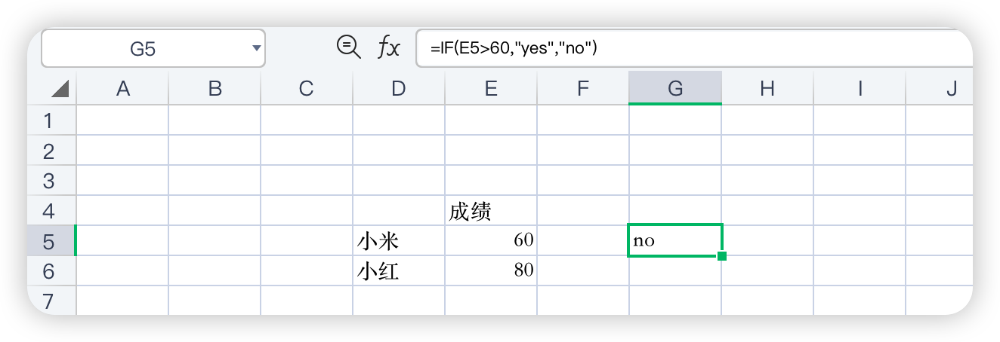

# ###Excel函数公式

想让每个数都乘以0.2，第一个单元格瓦们写上 = G2 * C14 但这个不能向下拖，因为，函数的G2会变成G3，这个没有关系，但与之一起变化的还有C14会变成C15，但C15是没有值的。我们需要将C14这个14给定住，所以可以在前面加一个$符号进行锁定

锁定完公式变成G2* C$14

if函数的运用

分区见统计  cmd+shift+enter

cmd+shift+enter

