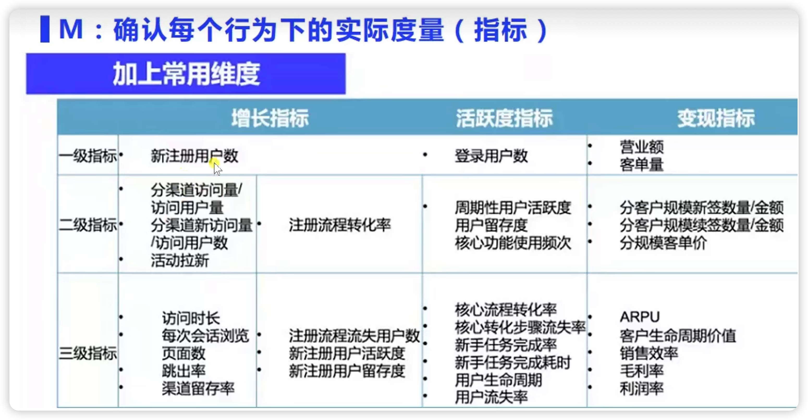
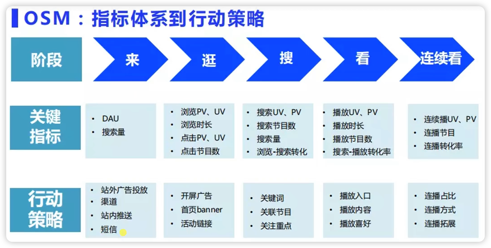
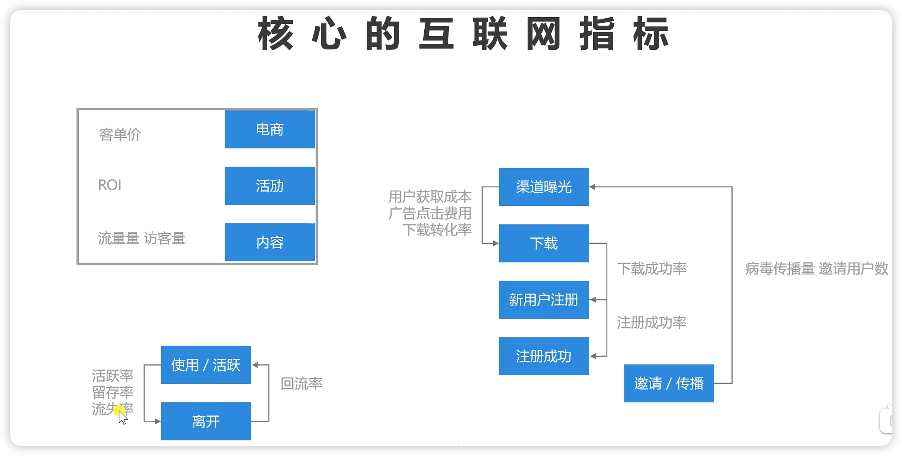
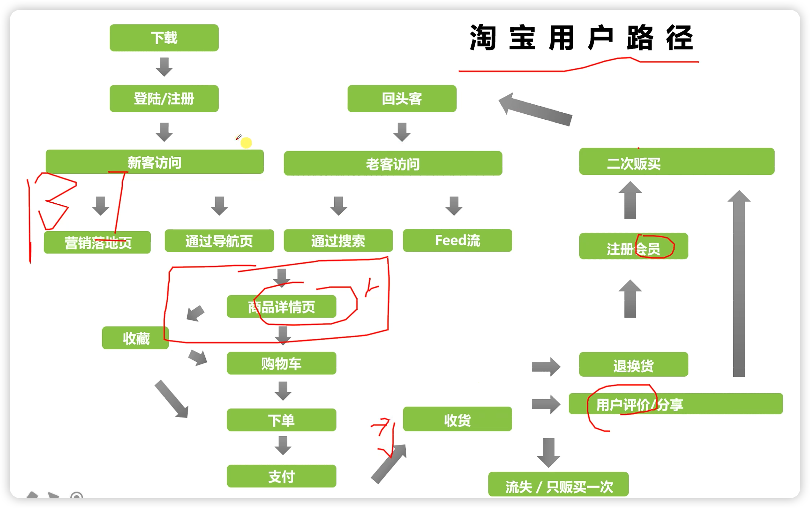
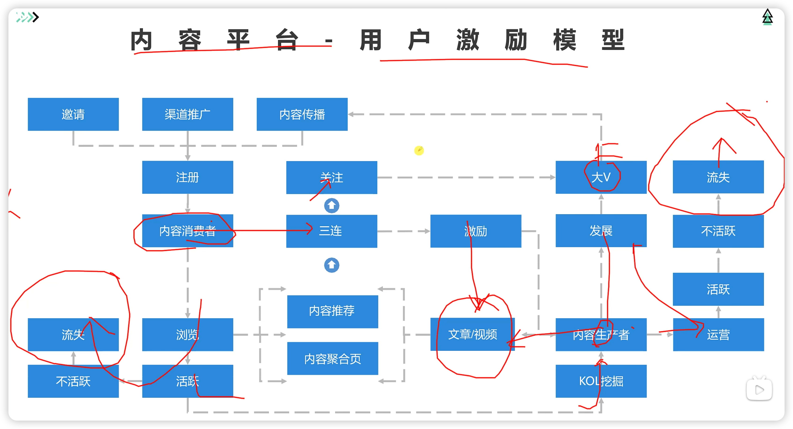
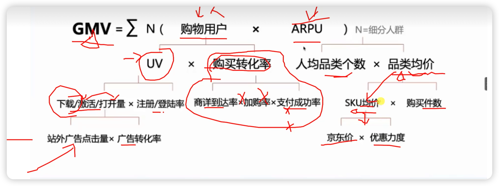
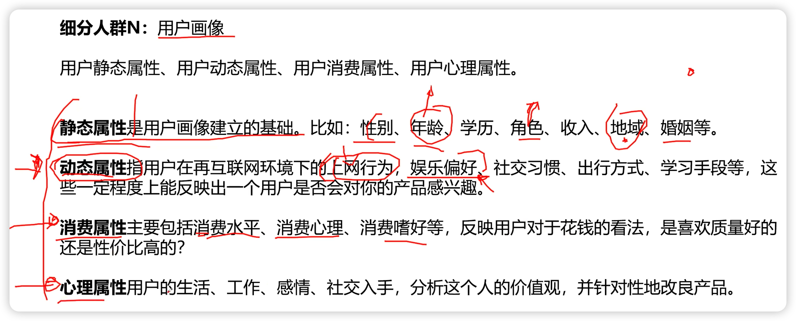
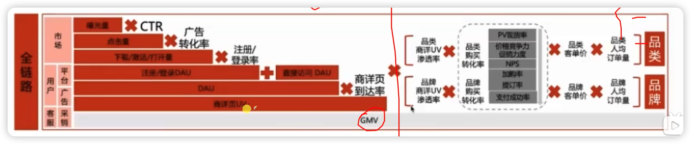

# ###指标与指标体系

指标是统计学的范畴，将说明总体数量特征的概念称为指标。

数据指标有区别于传统意义上的统计指标，它是将业务单元精分和量化后的度量值。

指标的构成 1.维度 2.汇总方式 3.量度

列子 ：公司规模：

​			在维度上 （总人口数，占地面积，生产总值，月均产量）

​			在汇总方式上（求和，求平均值，其他统计量）

​			量度（人，平方米，¥，件,瓦）

## 指标的类型

### 基础指标

业务实体的总和： 订单数，DAU

### 复合指标：

建立于基础指标，由规则运算形成    ARPU，好评率 

### 派生指标

建立于基础&派生，与维度，统计，管理等属性结合产生。  双十一成都订单数

## 电商指标体系

1总体运营

2.网站流量

3.销售转化

4客户价值

5.商品主题

6.营销活动

7.风险控制

8.市场竞争 

## 搭建指标体系的方法OSM

O：object(目标)

S:   Strategy(策略)

M：Measure(度量)

O	确定核心指标

S：关键路径

例如：对于长视频而言

阶段 来- > 逛 -> 搜 ->看 -> 连续看 ->买

关键指标 ：DAU

​					搜索量

​					浏览PV,UV

​					浏览时长

​					点击PV,UV

​					点击节目数

​					搜索UV,PV

​					搜索节目数

​					搜索量

​					浏览-搜索转化

​					

​					播放UV,PV

​					播放时长

​					播放节目数

​					搜索-播放转化率

​					连续播PV,UV

​					连播节目

​					连播转化率

行动策略

举例，用户路径

用户激励模型

## Dog东北极星指标拆解

GMV

细分人群

