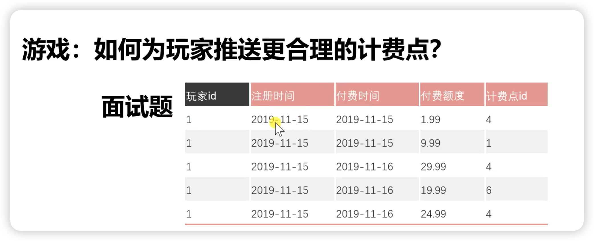

# ###数据分析与建模

准备一个电动取车上市的推广策划，预算是20W，一个月的时间准备，你会怎么规划 (奔驰面试题)

提问：

首先，我们发现题目给出的信息非常少，我们是可以和面试官沟通。

​	这个电动车定价多少钱？

​	电动车的产品定位是什么，有什么产品特色？技术上？外观上？

​	电动车的目标用户画像是怎样的？

这款电动车汽车定价20W左右。

在技术上突破了传统电动车续航短，充电慢的缺点，性能上对齐传统汽车，但是比传统汽车更节能经济

适合工作了3-5年的1，2线白领人群，男性居多，大概有3台车可以在推广时使用

What-主题内容

策划的主题是“电动，从此环保奔驰”，强化大家对电动，环保和性能的感知

Why-活动目的

这个策划是扩展年轻群体对电动汽车的认知，培养一批种子用户。预期传播覆盖人群200w+

Who-人员

内部：根据内部人员情况，做好工作分撇安排

合作方：提前联系并确认好供应商，合作媒体，宣传资源。

When-活动时间

配合上市时间，推广时间在上市前2周，为上市做好预热。

Where-渠道

1.提前制作宣传视屏，选择汽车kol的媒体，虎扑等直男社区投放。(传播目标100w+)

2.与商场合作，开设试驾点。事先在网上开放报名，邀请网友在现场体验驾驶，记录并制作vlog视屏。(现场活动，参与人员有限)

3.后期vlog传播，保持话题热度（传播目标100w+）

How -方式

前期准比一个月，整个推广策划大概需要7天时间，宣传视屏策划制作，前期活动准备同步进行，大致需要20天时间，留下3天做推广上线前的调整时间。

全程实施监测效果，包括线上的播放量，转赞评等数据，线下的活动口碑等，活动结束后完成活动总结报告，对推广的效果做出总结

How much -金额

总预算20w

宣传视屏拍摄预算5w，kol新媒体投放预算7w，商场试驾预算7w，多处一万作为备用资金，应对一些突发情况

游戏：如何为玩家推送更合理的计费点

