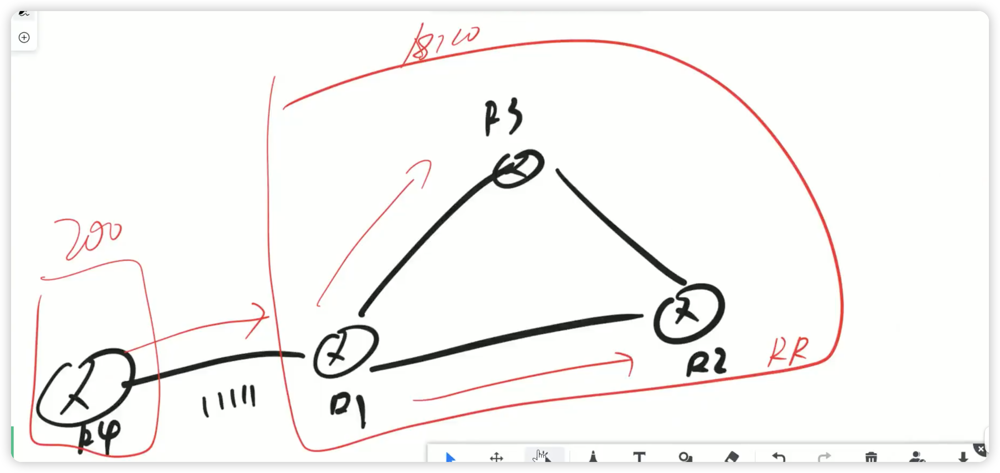
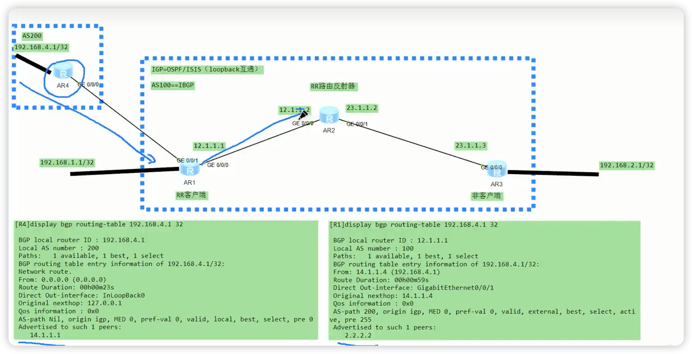

# BGP后续

### 原则三


原理大概如下，R2学到了传给AR1，但不会传给他边上这个。


这个i就是从IBGP邻居学到的。

再到R5上


从IBGP对等体获取的BGP路由，不会在发送其他IBGP对等体。也就是R1不会，而不是R5不收。来看最后一条。


BGP的同步规则

同步是为了解决BGP的路由黑洞问题，假如A点是总公司，B点是分公司，A点想和B通信，A点连着R1，根据第三个·原则，直接让R1和R3建立BGP跨设备建立邻居，这样A点就可以连接到B点了，这个在路由层面是可以达到的，总部A已经有了B点的路由，分布B也有了A总部的路由。但在转发层面不行，假如A点是192.168.1.1 到192.168.2.1B点。A点有没有2.1的路由，是R1给他它的，R1的是R3给它的路由。但是就是但是，他的数据包不是直接飞到了R3，他是一步步传的，下一步到R2.。但是R2压根没有1.0和2.0的路由。没有怎么办，就丢弃了。

我们再看看这个同步原则，就是R3从·R1学到一条IBGP的路由，比方说是1.0/24。他不能给他的EBGP邻居也就是B点。除非他在他的ospf里面也能学到2.0/24。那也就是是，如果R3在ospf能学到2.0/24的路由，那么R2也就能学到2.0/24的路由，那自然就可以传了，路通了但是有个很傻叉的问题，既然要在ospf学到，那为什么还要搞BGP，直接全部用ospf不就得了。


去R5上看看，自动关闭了同步，因为太蠢了。


那么怎么解决这种问题呢？

方法一，全互联。后面再说


看第一题，答案是错的，因为是IBGP用环回接口，而不是EBGP

2.对的

3.可以传递路由但是加不了表

4.错


一边是AS100，一边是AS200，区域内都是环回地址，不过两个AS之间不知道对方的环回接口地址，那么使用直连去建立EBGP的关系。而EBGP的邻居还有个特点，就是他的数据包ttl=1,也就能经过一台设备，也就只能一跳。那我们就要设备多跳，把ttl的数值拉到255。


在R1上抓个包，可以看到ttl的值是1。那就是R1把包传给了R2的g0/0/0接口，就没有了。还怎么发给环回地址2.2.2.2。


在R1上输入

```java
peer 2.2.2.2 connect-interface lo0
```


```java
peer 2.2.2.2 ebgp-max-hop  ?    //可以看到最多255
```


```java
peer 2.2.2.2 ebgp-max-hop 30
```

再去看看，可以看到条数变为了30


如果直接回车

```java
peer 2.2.2.2 ebgp-max-hop       //直接回车，发现ebgp-max-hop变为了255
```


<u>**不过这就是一个错误的示范，因为EBGP就不建议环回口建立邻居。**</u>

**如果EBGP邻居非要用环回口建立邻居，需要记得配置，更新源以及EBGP多跳。**


1.179

2.2种，一种IBGP，一种EBGP。划分的依旧就是AS号。


### BGP报文


抓一个update报文前面的头部信息没什么好看的，我们注意到NLRI（网络层的可达信息）

BGP的路由不叫路由，叫NLRI


第一个就是长度，就是掩码。第二个就是NLRI的前缀，也就是目标地址


Notification实验

在R1上先去掉已经配置好的 bgp 100    然后故意配错邻居的所属AS


去看抓包，可以看到open报文报错，子代码是open里面的peer是错的。


也可以通过命令看

```java
dis bgp error
```


针对于router-refresh有两种情况

假设R2发送一条消息到R1，cost值设为5，R1针对通过router-policy把cost值改为10，这样做完以后不会立即生效，R1会发送一个路由刷新。让R2在重新更新一次路由过来，接着再把里面的5换成10


还有一种情况。R1发送路由到R2的cost值是5，他自己通过router-policy,把自己的cost值改为了10，他也不会立即更新。在出方向发送最新的路由，让R2把最开始的5改为10。


实验

有空就来定给补上-----见p14末节


## BGP状态机

啥叫withdrawn routes.你也可以理解为删除的路由，或者撤销的路由


BGP状态机


国庆后，我来补上。-----稍后期待


## BGP的RR配置


gre隧道。


为什么会有RR，全互联有三个问题

1.配置量大

2.可扩展性差

3.需要维护大量的TCP及BGP连接，


RR就可想象成一面镜子。R2就是RR，不管从R1学到什么路由，都统统反射出去。R1和R3叫做R2的客户端。但R1和R3不知道自己是客户端，只有镜子才知道客户端是谁。


四个路由的话，就谁都可以做RR，而且RR也不一定就一个。


先做好基础配置


这边在R1上宣告了11.11.11.11。但是穿不到R3上

在R2上配置反射器

```java
peer 1.1.1.1 reflect-client      //指定路由反射器的客户端
```

反射器有个规则：从客户端收到的路由会反射给非客户端，也就是说，R3已经收到了。

R3上验证，现在在R3上network一个地址，那么R1也能收到，你就想镜子肯定是两边都有的。


## RR反射规则与防环

先说一下更新源，就是R1连接R2，如果有两条路，可以和10.1.1.2或者23.1.1.2连接。但任何一条线断掉，邻居都有可能会断。那么最好的情况就是用环回接口来连，就是就算10.1.1.2的线路断了，他还可以去连接23.1.1.2的这条路。估计正常的一条断了邻居就断了，不会再去找23.1.1.2在连。但环回地址就会再去连接23.1.1.2的这条路


ospf的router-id是ospf的，而bgp的router-id是bgp的，你可以在一个机子上配置ospf的router-id为5.5.5.5  你也可以在bgp上配置router-id为6.6.6.6。如果你不配两个都没配置，也没事，华为的会在全局上给你一个9.9.9.9的router-id。

来看RR的规则


这里的非客户端是R3，RR学到后可以反射给R1

实验验证，在R3上宣告一条路由


再去看看R2


验证R1有没有收到，收到了。


至于第二条规则，先来看一下下图，意思就是客户机A发送一条路由，反射器会讲这条路由反射给非客户机A，非客户机B，还会反射给客户机B，但是不会在发射给客户机A的了。（人话就是除了自己不传，其他客户机非客户机都要传）


BGP有一条命令可以查到RR发送的反射路由。

```java
dis bgp routing-table peer 3.3.3.3 advertised-routes
```


可以看到R2给R3通告了192.168.1.1这条路由。

我们的在看一下，R2给R1通告了什么路由。


至于第三个原则，发送和反射是不一样的，反射会多两个属性是用来防环的。R1发送给R2，R2是RR，就会发送给R3，如果R3也是RR，就会成环，本来是防环的，现在又有环了，那么就要加两个属性用来防环。但是如果说这条路由是从RBGP学过来的，那就不一样了。


来看从EBGP学过来的路由，他会传给R1，R1会给R3一条，R1也会给R2一条。如果R2和R3是镜子则继续传，如果不是就不传了。




R3比R1多了两行，就是Originator和Cluster list。只要被反射器反射就会多者两行。这两行实际上就是用来防环的。


可以看到没有经过反射的二条路由没什么不同，就是发送的对象不同，一个发送给14.1.1.1一个是2.2.2.2 



在来看，R2也没什么变化，就多了RR-Clinet route


但如果经过反射后在R3上看就不一样了。可以看到的是，R3上多了两个属性。


那么问题来了，为什么要加这两个属性？有什么毛用？

这两个属性的作用就是用来防环的。

那防环为什么需要两个属性？

这两个属性一个是针对RR客户端的防环，一个是针对RR的防环。


情况如下，R2发送一条路由给R3，路由的始发ID. 	 Originator_ID的值是2.2.2.2。R3反射给R1，R1再将路由反射给R2，R2一看Originator_ID是2.2.2.2。也就是说转一圈回来了。就不接收了。也就破环了。


Cluster_ID是这样的,R1发送一条路由，经过R2反射给R3的时候就会在Cluster_list记下22.22.22.22。反射给R3的时候，R3在讲这条路由发射给R4，CLuster_list就会记下33.33.33.33。 R4在将路由反射给R2，同时 就会在Cluster_list记下44.44.44.44 。  R2收到反射的路由一看Cluster_ID有22.22.22.22。就不继续反射了。


## BGP路径属性AS_PATH


Cluster_id是可以修改的。

```java
reflector cluster-id 222.222.222.222
```

修改Cluster_id


IBGP是用水平分割来防环的，AS_PATH可以阻止EBGP的成环。


假设R1和R3有一个邻居关系。传出去的AS_PATH路径会变成（站在R1的视角）300，200，100。R1一看有一个路径就是自己，就明白这条路由是从自己这边出去过的，就不接收了。


对于第三点，就是只有传出去才改变。在内部的时候是不会变化的。


AS_PATH是EBGP防环的根本。


可以试试让R6和R1建立邻居


## 路由汇总后的无序路由


1.有序，默认的

2.无序，在路由汇总手动配置添加，为解决路由汇总后明细路由丢失AS_PATH属性的问题，用于防环。

做实验，


再去R2上看看


在R2上做个汇总，

```java
aggregate 192.168.0.0 255.255.0.0 
```

汇总后去R1上看看，暂时没有抑制明细。


再去R2上抑制明细路由

```java
aggregate 192.168.0.0 255.255.0.0 detail-suppressed
```

在看已经被抑制了


汇总好了，可以看到path的路径丢失了，非常可怕，如果R1和R3建立邻居的话，必将路由传给R3的。会造成环路。


那么怎么解决？


```java
aggregate 192.168.0.0 255.255.0.0 as-set detail-suppressed 
```


再去看，有了。


再去R1上看，他离开了100，所以会追加上


除了第一种，二三都比较阴间。非常不建议使用


在R2上

```java
route-policy aspath permit node10
apply as-path 888 addittive
```

R2:

```java
peer 12.1.1.1 route-policy aspath export
```

在R1上刷新一下

```java
refresh bgp 12.1.1.2 import
```

在原有的基础上，添加了888


## Origin起源属性


igp的优先级是大于incomplete的。


## NextHop下一跳属性

这里我理解的下一跳不是下一台路由器，而是下一个AS，特别是对EBGP来说。


就是啥呢，R1传一条路由给R2，是EBGP关系，传递的路由下一跳就是10.0.12.1。也就是传递路由的接口。

EBGP的下一跳，是建立邻居的地址

第二种，就是从EBGP学到的路由，传递给自己的IBGP对等体，下一跳不变，所以需要改


如果用connect-interface lo0的话，下一跳就变成了环回地址。


实验有空来补。


## Local_Preference本地优先级属性

同一个AS内，后续R2发送数据包要离开本AS的首选路径，看Local_preference。说人话，下一跳变成R1了。这条属性只会出现在IBGP里面。


R1只有一个邻居就是R3，R2也只有一个邻居，也是R3.那么同杨宣告2.2.2.2 R3会接受哪一个？


可以看到R3接受了R1，但目前的LocPrf的值都是100。


至于为什么选R1

```java
dis bgp routing-table 2.2.2.2 32
```

优选的原因是router-id


要想选择R2就要调大优先级


```java
ip ip-prefix 22 permit 2.2.2.2 32
route-policy localpre permit node 10
if-match ip-prefix 22
apply local-preference 200
```


```java
peer 102.168.1.2 route-policy localpre import
```


至于为什么1.1.1.1的路由只有一条，只有192.168.1.1传过来了，为什么呢？

在写路由策略的时候要写node 999 或者node 数字。不能不写。否则别的BGP路由匹配不上路由策略就是拒绝掉。

```java
route-policy localpre permit node 999
```


方法二

在R2上

```java
bgp 100
default local-preference 888     //意思是R2上传1.1.1.1优先级是888，传2.2.2.2也是888
//这里有个问题，就是，R2上2.2.2.2会被R3修改成200，R1上的2.2.2.2没有设置就是默认100，所以2.2.2.2走R2。   但R2上1.1.1.1没设置，该多少多少，那么1.1.1.1在R2上就是888，此时虽然R1上的1.1.1.1到了R3会被提高成200，但没有888高，则1.1.1.1走R2这条路。    
```


locPrf这个值不外传，看R5的这个值就是空的。虽然不传，但是默认值就是100


那么R6的值有没有？有的，R5传给R6的update报文中，会讲默认值给加上


## BGP团体属性过滤实验


## 关于全互联小细节和自己的认知


来说一下这个疑惑，为什么会这样，大多人会觉得，既然已经R1，R2，R3都是邻居，那是不是可以去掉R1和R3的连接，其实不然，不能去，因为BGP是建立在TCP的基础上，现在都是邻居了，说明TCP的联通已经做好了，也就是地基已经做好了，剩下就是盖房子。那么开始做BGP的连接，也就是R1和R3的IBGP邻居关系，不过我感觉这是有2层，为什么这么说，就是如果没有建立邻居之间的全互联，而是R1和R3建立邻居，没有和R2建立邻居，那么至少在路由层是可以发出去的，R4和R5上都有去往对应的路由信息（R4上有10.10.5.5。 R5上则有10.10.4.4）。也就是在路由层是有的，但是如果R1只是和R2建立邻居，R2在和R3建立邻居，但R1没有和R3建立邻居，那么此时R4和R5上并没有路由（R4上没有10.10.5.5。 R5上没有10.10.4.4）。也就是说TCP层建立好了，但是BGP层没有建立。也就导致BGP路由没有发出来，

（可以理解为需要两步，一步是BGP，这个可以能保证对方收到路由，但是ping不通，因为TCP还没有连接，只有做完这两步才能通）。
