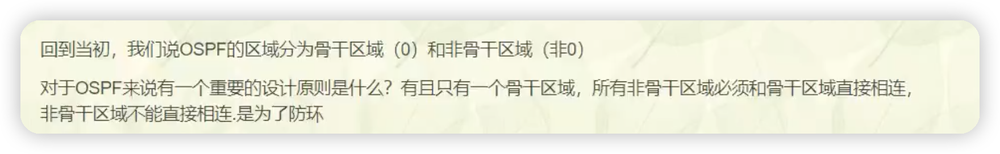

# OSPF后续

## 三类LSA的原理


这张图解释了为啥要非骨干区域要连接着骨干区域，ABR会来回传，造成环路。


是否好奇，路由器之间怎么知道谁是ABR

此时在R3上加一个环回地址，这样一类LSA就有变化。


这样我们查看报文，可以看到flags里面写着R3是ABR。





## 3类LSA的防环

ABR会进行汇总


这个意思就是说，area1传给area0的路由，不会让area0在传递三类LSA的时候在传给area1，因为这是area1之前传过去的，这就叫水平分割。


这个属于非正常情况，没有太大意思。就说一下就行，不做实验了。


可以看一下这个图，R1和R2是属于area0，而R3和R4都是属于area1，R1是1.1.1.1。 R2是2.2.2.2    R1是不是通过一类LSA就可以学到了2.2.2.2这条LSA，但是R1和R2都是ABR，R2会讲2.2.2.2传给R4，R3，R1，这样是不是就是三类LSA，R1接受到2.2.2.2属于三类LSA，是不是就意味着R1要到达2.2.2.2的话，就需要走 R1 -> R3 -> R4 -> R2这条路。等于绕了一个大圈，所以正常人是不会这么设计的。


## VLINK虚链路

来说一下情况，原本区域0的线断了，就导致了这种情况，现在在area1和area2之间还有一根线。   连着area2的ABR会将area2的LSA变成3类的向外发通过线发给area1，但是上面说到过，就是非骨干区域收到的3类LSA不参与区域间路由的计算。这样发过去也没用。就导致没路由。


可以这样理解，就是原本是如图片中的area0连着area1，area1连着area2，这样就会导致R3不是ABR，没有办法传递LSA，但是如果用虚连接的话，就相当于扩大了area0的范围，导致R2也变成了ABR，这样就可以传递LSA了。


还有一种情况，010这种情况，area0被分割了，中间是个area1，但非骨干的三类LSA是不能参与计算的，这样area1即不能传给左边的area0，又不能传给右边的area0 ，就又断了。


这种在做虚连接，area0的区域又扩大了，现在R1传递给R4相当于1/2类LSA了。


还有第三种情况，叫123，如这种。在建立虚连接，


实验123这种情况。


可以看到R1上只有1.1.1.1和2.2.2.2    果然没有3.3.3.3和4.4.4.4


来加一个虚链路，就能解决。虚链路是一条属于区域0的虚拟链路，依靠物理链路承载。因此需要在物理链路对应的区域中去配置和对端的建立虚拟链路(使用对端RID地址)。还有就是虚拟链路是建立在物理链路上，所以物理链路不断，虚拟链路就不会超时。物理链路中R2和R3是一对邻居，在vlink中，R2和R3也是一对邻居


R2:

```java
ospf 10
vlink-peer 3.3.3.3
```

R3:

```java
ospf 10
vlink-peer 2.2.2.2
```

在R2上查看vlink邻居

```java
dis ospf vlink
```


看看数据库，建立成功。


华为的这个不是特别好，就是说，dead不太对，在思科上，会有DNA，DNA就是 Do no Age.就是永远不会老化。


不建议做虚连接。


## ospf外部路由


这里可以看到开销值是1，


## 5类LSA的FA地址

