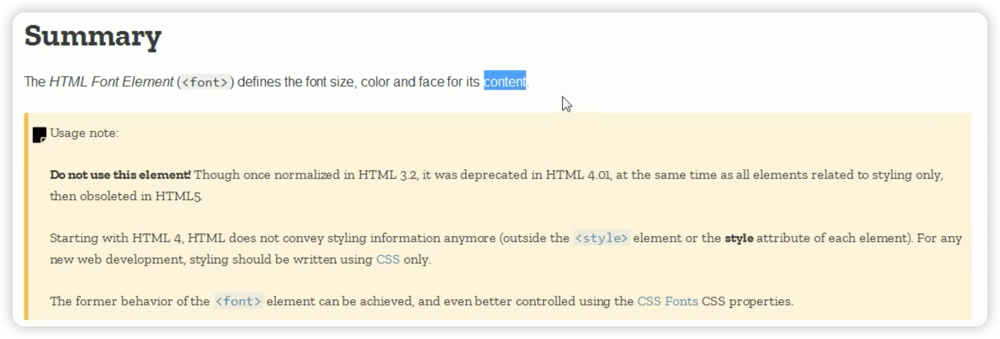
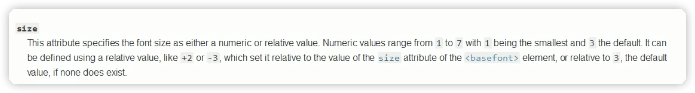
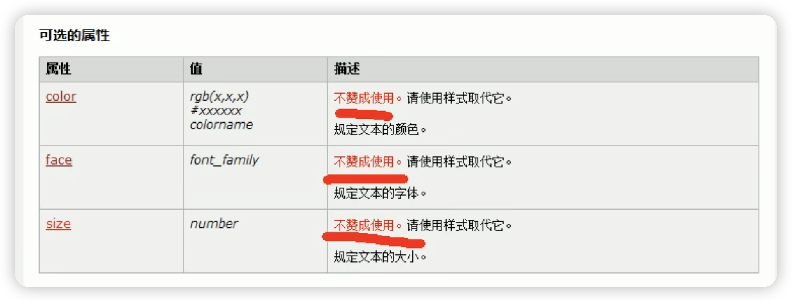

Web前端



```html
<!DOCTYPE html>   								<!--文档申明-->
<html lang="en">  								<!--lang属性用来指定语言，可以指定为zh-->
<head>
    <meta charset="UTF-8"> 				<!--自结束标签，meta用来设置网页的基本信息，utf-8指定网页编码字符集，避免乱码-->
    <meta name="viewport" content="width=device-width, initial-scale=1.0">
    <title>你猜我在哪？</title>
</head>
<body>
  	<!--这是一个元素，可以设置字体大小，字体颜色-->
    <h1>这是我的<font color="red" size="1">第一个</font>网页</h1>
</body>
</html>
```

不过这个大小也有规定，1是最小的，3是默认，7是最大。



不过查看他的文档可以看到，其实是不赞成使用的。



因为html只管结构，你只需要管好自己的事，css只负责表现。也就是自己只管自己的事。而字体的大小颜色都属于表现，所以应该是css负责的。