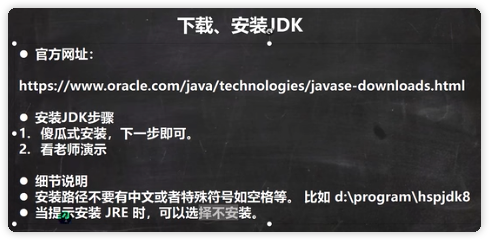
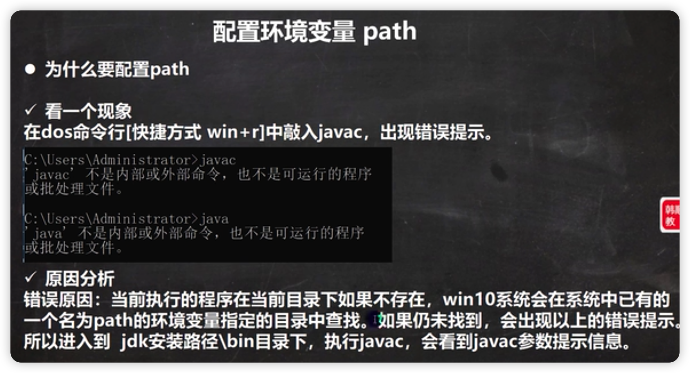
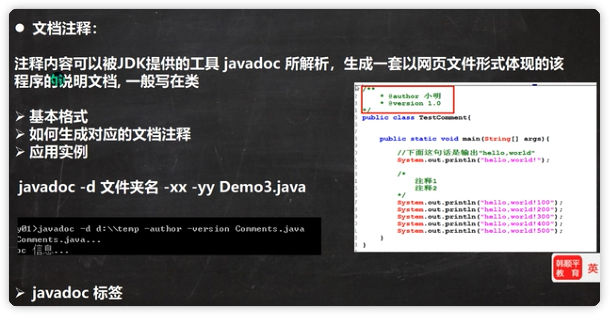
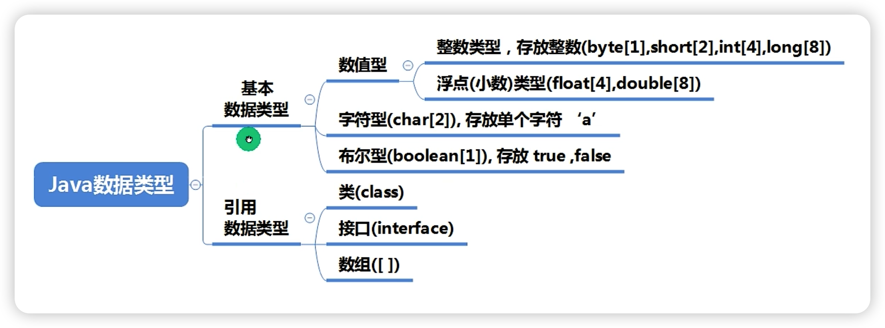
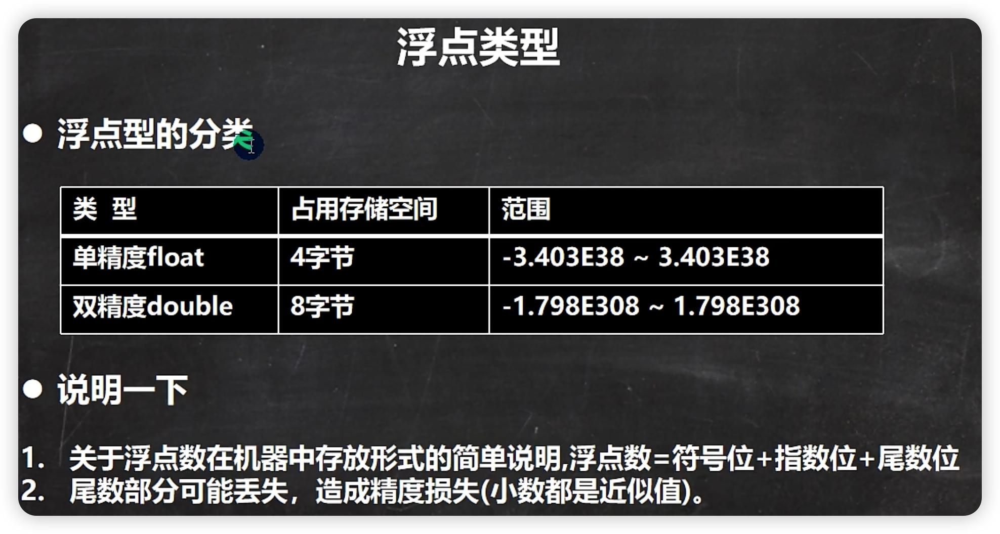
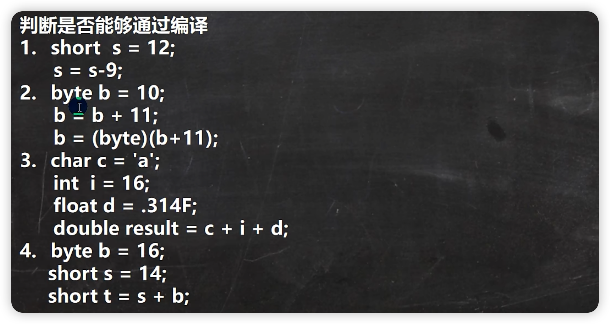
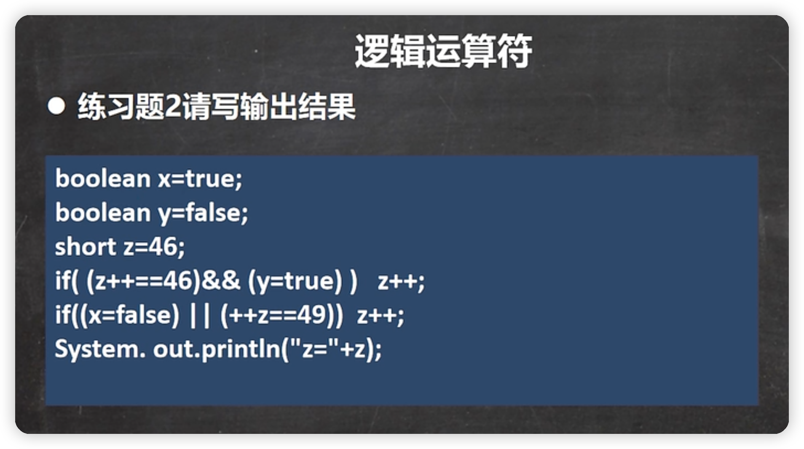
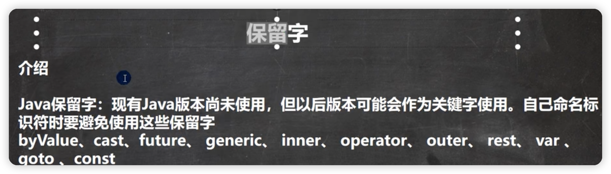
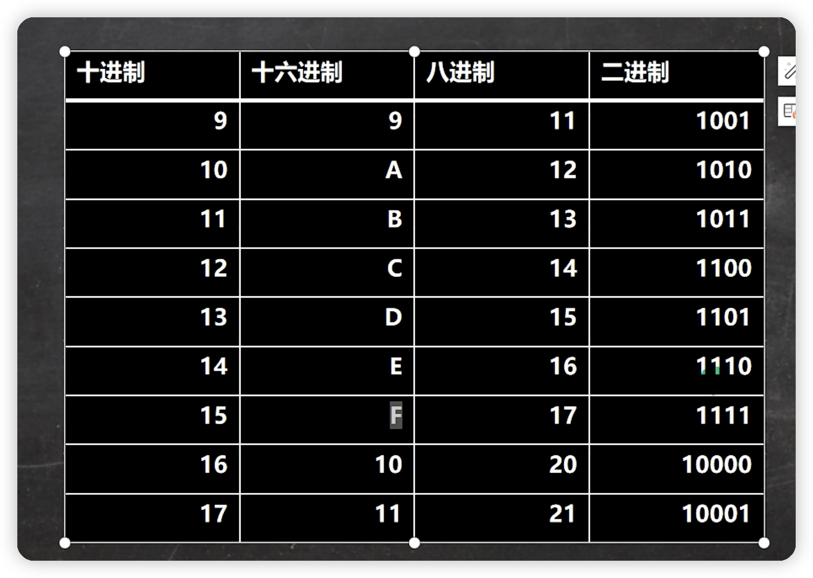
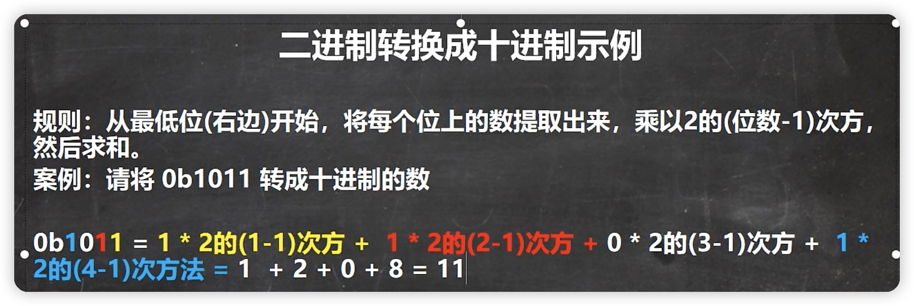

# java基础复习-韩顺平


后缀是java的文件，是人写的，但机器看不懂。所以在执行的时候，编译器就将.java的文件编译成机器可以看的懂得.class文件。命令就是javac 文件名

java的重要特点


跨平台，就是一个代码第一次编译成了.class文件，可能面对着Windows又或者Linux。但只要编译完后不管面对什么系统，都不要在编译了。

解释性和编译性就是一个能被机器直接执行。

之所以.class文件能跨平台就是因为它有jvm转换，不同的系统有不同的jvm


jvm包含在jdk中


总结一下，如果我是windows系统，我会用javac来进行编译，编译完后成了.class文件。如果我只是在本机上运行。OK，没事我安装了windows的jvm，可以运行出来结果。好，如果我只是在windows上写代码，然后将其打包到linux上运行，那这些代码会被Linux上的jvm进行编译，使得也能运行

如果你不是一个程序猿，你可能只需要一个jre就够了。因为你只需要拿着编译好的文件就能运行了。根本不需要javac


下载安装jdk,比较简单就不多说了



为什么要配置环境？




打开环境变量-> 点击新建 变量名输入JAVA_HOME，值写上你的真实地址。写好后，在找到path 找到后，增加一条指令%JAVA-HOME%\bin完成后关闭shell的命令行，再次打开就可以用Java和Javac了


这二个上下配置都能用，就是上面的是用户变量，就只有这个用户才能用，而下面的是系统变量，配置了都能用。就是范围更广。


开始用submit来写代码，如果字太小，可以点击首选项，点击“设置-用户”，后修改font_size的值，字体会变大，后开始文件->保存


开始写代码：


写好后，执行javac后发现咩有生成.class文件，	其实是编码的问题，shell黑窗口的编码是GBK,所以需要将这个写好的java文件改成GBK格式的文件 文件->设置文件编码->GBK.需要重写保存即可

同时运行的时候，java hello就行，不能写成java hello.class.因为java的编译者自认为是hello这个类的文件，如果你写成 java hello.class.编译者会认为你编译的是名叫“hello.class”的这个类。故报错


我们把.java文件叫源文件，把.class文件叫字节码文件

对于已经修改的文件一定要再次javac进行再次编译


每一个类编译以后就会生成一个.class文件


这个类只能有一个public，其他都没有加上public 

第七点，就是你的名字和你的public类要一样

一个public的类上写了三个主方法，其实也是可以的，如下图。运行的时候，输入对应的类就行。先javac编译一下源代码。然后想运行什么就java那个类。java Dog.	 Java Tiger


学习方法


## 转义字符


```java
public class hello{
  public static void main(String[] args)}{
  	//"\t"的使用
  	System.out.println("北京\t上海\t天津")；  										//结果是：   北京	上海	天津  
    //\n的使用
    System.out.println("jack\nsmith\nmary")；  							  //结果就是换行 jack
																														  //						 smith
      																											  //             mary
    //   \\的使用
    System.out.println("c:\\windowns\\system32\\cmd.exe")；   //运行的结果    c:\windowns\system32\cmd.exe
    //    \"的使用
    System.out.println("老韩说:\"好好学java，有前途\"")；        //运行的结果    老韩说：好好学java，有前途
    //    \'的使用
    System.out.println("老韩说:\'好好学java，有前途\'")；        //运行的结果    老韩说：好好学java，有前途
    // 		\r的使用  这个回撤后会把光标放在最前面，也就是韩的位置。
    //因为他只是回车，不是换行
    System.out.println("韩顺平教育\r北京")											 //运行的结果    北京平教育
    //   \r\n
    System.out.println("韩顺平教育\r\n北京")										 //运行的结果    韩顺平教育
																														 //							北京
	}
}
```

### 课堂练习


我的答案： 正确

```java
public class hello{
  public static void main(String[] args)}{
  	System.out.println(书名\t作者\t价格\t销量\n三国\t罗贯中\t120\t1000)；
	}
}
```

## 初学者常犯错误


## 注释

以后写代码都要养成写注释的习惯


### 单行注释

```java
//单行注释
```

### 多行注释

```java
public class hello{
  public static void main(String[] args)}{
  	/*
  	这里面的内容不会被jvm给编译
  	多行注释里面不允许有多行注释嵌套
  	*/
	}
}
```

多行注释里面不允许有多行注释嵌套

```java
public class hello{
  public static void main(String[] args)}{
  	/*
  	这里面的内容不会被jvm给编译
  	多行注释里面不允许有多行注释嵌套
  	System.out.println()
  	
  		/*
  		*/
  
  	*/
	}
}
```

可见这个是不可以的，不能嵌套，因为编译器看到了嵌套的*/时以为注释结束了。当看到下方还有一个*“*/”时会觉得语法错误

### 文档注释



## 代码规范


关于第3点，，如下面的图，只需要选中，然后按下tab键，就可以整体向后移动。如果移的太后了，可以按shift+tab键进行向前移动


第6代就是一行不要超过80个字符


## java_DOS原理

 

打开dos命令窗口

```java
md d:\\hspjava   //这个就是创建文件的命令
rd d:\\hspjava.  //这个事删除这个文件夹
```


### 路径详解

这章太简单了，就不多说了。


```
dir         //查看目录下有啥
```


## 本章作业


### 第一题我的答案：

```java
public class hello{
  public static void main(String[] args){
    System.out.println("hello world")
  }
}
```

### 第二题我的答案：

```java
public class hello02{
  public static void main(String[] args){
    System.out.println("姓名\t性别\t籍贯\t地址\n张三\t男\t安徽\t合肥")
  }
}
```

### 第三题我的答案：

jdk = jvm + jre

***正确的答案***：jdk = are + 开发工具  	jre = jvm + 核心类库

其余不写了 


## 变量


```java
public class Var{
  public static void main{
    //方式一
    int a ;
    a = 100;
    System.out.pringln(a);
    
    //方式二
    int b = 100;
    System.out.println(b);
  }
}
```

当然不止有int类型了


```java
public class Var02{
  int age = 20;
  double score = 99.9;
  char gender = '男';
  String name = "king";
  public static void main{
  	System.out.println("人的信息如下");
    System.out.println(name);
    System.out.println(age);
    System.out.println(score);
    System.out.println(gender);
  }
}
```


对上面的解释如下：


## Thesixshadow.com : vpn软件

## 程序中的+作用

运算顺序时从左到右的


我的答案：

```java
1.198
2."198"
3."103hello"
4."hello103"
```

正确答案：

```java
1.198
2."10098"
3."103hello"
4."hello1003"
```

## 数据类型

整体比较简单，可以自行查看





## 整型细节


```java
public class IntDetail{
  public static void main(String[] args){
    //java的整型常量默认为int型，声明long型常量须后加‘l’或者‘L’
    int a = 8;
    int b = 1L;//这个会报错，相当于把能装8个面包的盒子，塞入只能装4个面包的盒子，精度会缺失
    long c = 1L; //这个就没有问题
  }
}
```

关于第四题：


## 浮点数使用

浮点数=符号位+指数位+尾数位



## 浮点数细节


```java
public class FloatDetail{
  public static void main(String[] args){
    //java的浮点型常量默认为double型，声明ffloat型常量须后加‘f’或者‘F’
    Float a = 1.1;   //这个是错的，因为默认是double,八个字节，而float4个字节，显然装不下
    Float b = 1.1f; //这个就是对的
    Double c = 1.1;
    Double d = 1.1f;  //这个也是没有问题的，因为属于小的包装到大的包
    
    Float e = 0.123f;
    Float f = .123f;    //这个也是对的，如果是零点几，可以省略前面的0.   所以结果就是0.123
    
    //科学计数法如：5.12e2 [5.12*10的二次方]   5.12e-2 [5.12 / 10的二次方]
    System.out.print(5.12e2);  //512.0. 因为是double类型，所以会有个.0
  }
}
```

### 浮点数陷阱

***这里有个重要的点：当我们对运算结果是小数的进行相等判断是要小心的，应该是二个数差值的绝对值在某个精度范围内***

```java
public class FloatDetail{
  public static void main(String[] args){
    double num1 = 2.7;
    double num2 = 8.1 /3;
    System.out.print(num1);  //这个就是2.7
    System.out.print(num1);  //这个是2.69999999...7    因为他以为8.1后面还有，所以精度问题，会有缺失
  }
}
```


***如果是直接赋的值，可以判断相等***


## java API文档

网址：https://www.matools.com

Java8:https://www.matools.com/api/java8


4.（1）可以先找到包，在找到类，在找方法

​	（2）直接在API索引上搜索


## 字符型的使用

char两个字节，可以是汉字。说明一下，字符类型可以直接存放一个数字


```java
public class Char01{
  public static void main(String[] args){
    //以上代码
  }
}
```


## 字符细节


```java
public class CharDetail{
  public static void main(String[] args){
    //在java中，char的本质是一个整数，在输出时，是unicode码对应的字符
    char a = 97;
    System.out.print(a);  			//a
    char b = 'a';
    System.out.print((int)b);   //92
    char c = '韩';
    System.out.print((int)c);   //38889
    char d = '38889';
    System.out.print(d);        //韩
   //char类型是可以进行运算的，相当于一个整数，因为它都有对应的Unicode码
   System.out.print('a'+10);		//107
   
   char e = 'b'+1;
   System.out.print(e);					// c
   System.out.print((int)e);		//99
  }
}
```


## 字符型本质

实际上一个字节是256个字符，ASCI I是只用了128个


## 布尔类型


```java
public class CharDetail{
  public static void main(String[] args){
		Boolean isPass = true;
    if(isPass == true){
      System.out.println("考试通过，恭喜");
    }else{
      System.out.println("继续努力");
    }
  }
}
```

就是说，只能是false或者true，不能出现 Boolean a = 0  (等一切数来表示)


## 自动类型转换

小的是可以转成大的 


```java
public class AutoConvertDetail{
  public static void main(String[] args){
		//有多种类型的数据混合运算时，系统首先自动将所有的数据转换成容量最大的那种数据类型，然后在进行计算
    int n1 = 10;
    float f1 = n1 + 1.1； //这个是错误的，浮点数默认是double，所以属于大装小
    Float d1 = n1 + 1.1F; //这样就对了
    //当我们把精度（容量）大的数据类型赋值给精度（容量）小的数据类型时，就会报错。反之就会进行自动类型转换
    int n2 = 1.1； //错误，double->int，转换错误
    //（byte,short）和char之间不会相互自动转换。就是你不能把一个byte转换成char。short也不能转换成char，反之也是。
    //重点来了
    byte b1 = 10;   //这里会出现一个问题，就是10是int类型，怎么可以转换成byte类型
    								//当把具体数赋值给byte时，（1）会判断该数是否在bytes范围内，如果是就可以。
    
    
    
    //重点的点：这个代码是不行了，这样就会问了，为什么这个就不行，其实是这样了，n3是4个字节，内存中分配了4个格子，，将n3给b2就会出现装不下。
    //原因：如果是变量赋值，判断类型；
    int n3 = 1;
    byte b2 = n3;    //这个会报错。
    
    char c1 = b2;    //这个也是会报错，因为byte不能转为char,他们是二个独立的分支
    
    //byte,short,char听他们三者可以计算，在计算时，首先转换成int类型。
    byte  b3 = 1;
    short s1  = 1;
    short s2 = b3 + s1;     //错，因为 b3 + s1 => int
    
    //boolean是不参与转换
    boolean pass = true;
    int num = pass;					//这个会报错的，因为boolean不参与计算
    
    //自动提升原则：表达式
  }
}
```

### 小问题：

答案：错的，

因为byte，char，short这三个类型，只要参与计算，就会转成int类型，所以int转换成byte会报错。

```java
public class AutoConvertDetail{
  public static void main(String[] args){
		byte  b3 = 1;
    byte b4 = 2;
    short s1  = 1;
    int s2 = b3 + s1;
    byte b5 = b3 + b4;   //这个结果对不对？
  }
}
```

```java
public class AutoConvertDetail{
  public static void main(String[] args){
		byte a = 1;
    short b = 100;
    int c = 1;
    double d = 1.1;
    double e = a + b + c + d;    //这里面如果用float接受就会报错，更不用说int了。
  }
}
```

## 强制类型转换


```java
public class ForceConvert{
  public static void main(String[] args){
		int a = (int)1.9;
    System.out.println("a=" + a);  //1   造成精度损失
    
    int b = 2000;
    byte c = (byte)b;   
    System.out.println("c=" + c);  //-48   造成数据溢出
  }
}
```


```java
public class ForceConvertDetail{
  public static void main(String[] args){
		//强转符号只针对于最近的操作数有效，往往会使用小括号提升优先级
    int x = (int)10 * 3.5 + 6 * 1.5; //这个会报错，因为int会将10转为int类型，这样整体还是double类型，所以int接受会报错
    int y = (int)(10 * 3.5 + 6 * 1.5);// (int)44.0  -> 44
    System.out.println(y);
  }
}
```

### 强制类型转换练习

我的答案：1错。2.错。3.对。4.错



## String类型与基本类型的转换


```java
public class StringToBasic{
  public static void main(String[] args){
		//基本数据类型转 -> String
    int n1 = 100;
    float n2 = 1.1f;
    double n3 = 3.4;
    boolean b1 = true;
    String str1 = n1 + "";
    String str2 = n2 + "";
    String str3 = n3 + "";
    String str4 = b1 + "";
    System.out.println(str1 + \t + str2 + \t + str3 + \t + str4)
  }
}
```

String转基本数据类型需要用到包转类

```java
public class StringToBasic{
  public static void main(String[] args){
		String a = "123";
    int num1 = Integer.parseInt(a);  //这样就转成普通数据类型了
    Double num2 = Double.parseDouble(a);
    Float num3 = Float.parseFloat(a);
    short num4 = Short.parseShort(a);
    Long num5 = Long.parseLong(a);
    Boolean b = Boolean.parseBoolean("true");
    Byte num6 = Byte.parseByte(a);
    
    
    //怎么把字符串转为char  ->. 含义是指把字符串的第一个字符得到
    System.out.println(a.CharAt(0))    //'1'
  }
}
```


字符转基本数据的细节

```java
public class StringToBasic{
  public static void main(String[] args){
		String a = "hello";
    int num = Integer.parseInt(a);
    System.out.println(num);   //注定会报错
  }
}
```

## 本章作业

第一题答案：

N3 :30 N5:8


第二题：

```java
public class Homework02{
  public static void main(String[] args){
    char a = '\n';
    char b = '\t';
    char c = '\r';
    char d = '\\\\';   //错误，正确的答案应该是 '\\'
    char e = '1';
    char f = '2';
    char g = '3';
  }
}
```

第三题：

```java
public class Homework03{
  public static void main(String[] args){
    String a = "老人与海";
    String b = "小王子";
    System.out.println(a + b);
    
    char c = '男';
    char d = '女';
    System.out.println(c + " " + d);
    
    String e = "19.8";
    String f = "20.0";
    System.out.println(e + " " +f)
  }
}
```

第四题：

```java
public class Homework03{
  public static void main(String[] args){
    System.out.println("姓名\t年纪\t成绩\t性别\t爱好\nxx\txx\txx\txx\txx");
  }
}
```

## 算数运算符


### 算数运算符


```java
public class ArithmeticOperator{
  public static void main(String[] args){
    System.out.println(10/4);				//因为都是整数类型，数学上是2.5，在java中就变成2
    System.out.println(10.0/4);			//转俄格因为精度的问题，就变成了2.5
    double d = 10/4;   //2.0
    double d = 10/4;
    System.out.println(d);
    
    
    //取模，取余
    //在%的本质，看一个公式 a % b = a - a / b * b
    //-10 % 3 = -10 - (-10) / 3 * 3
    //10 % -3 = 10 - 10 / (-3) * (-3) = 1
    //-10 % -3 = -10 - (-10) / (-3) * (-3) = 1
    System.out.println(10 % 3);  //1
    System.out.println(-10 % 3);  //-1
    System.out.println(10 % -3);	//1
    System.out.println(-10%-3);   //-1
    
    
    
    //++用法
    int i = 10;
    i++; //自增 等价于 i = i + 1; 
    ++i; //自增 等价于 i = i + 1; 
    System.out.println("i=" + i);  //12
    
    /*
    *作为表达式使用
    *前++: ++i先自增后赋值
    *后++：i++先赋值后自增
    */
    
    int j = 8;
    int k = ++j;  //等价于 j = j + 1; k = j;
    System.out.println("j=" + j + "k" + k);  //9 9
    
    int g = 8;
    int h = g++;  //等价于 h = g; g = g + 1; 
    System.out.println("g=" + g + "h=" + h);  //9 8
  }
}
```

### 算数运算符面试题


```java
public class ArithmeticOperatorExercise01{
  public static void main(String[] args){
    int i = 1;
    i = i++; //规则使用临时变量(1):temp = i;(2)i = i + 1;(3)i = temp;所以这三步走下来就变成了i= 1了；
    System.out.println(i); //1
    
    int a = 1;
    i = ++i; //(1)i = i + 1;(2)temp = i;(3)i = temp;
    System.out.println(i); //2
  }
}
```


```java
public class ArithmeticOperatorExercise01{
  public static void main(String[] args){
    int i1 = 10;
    int i2 = 20;
    int i = i1++;
    System.out.println("i=" + i);  //
    System.out.println("i2=" + i2);
    i = --i2;
    System.out.println("i=" + i);
    System.out.println("i2=" + i2);
  }
}
```


```java
public class ArithmeticOperatorExercise02{
  public static void main(String[] args){
    System.out.println("还有" + （59 /7）+ "个星期天" + "零" + （59 % 7）+ "天");
    System.out.println("234.5华氏温度对应的摄氏度为：" + 5 / 9 *(234.5-100))； //这里面有个bug,就是5/9是一个小数，转为																																						int后就成为了0 ，后面不管成多少，都是0
      																																			//解决方法就是5写成5.0
      
    System.out.println("234.5华氏温度对应的摄氏度为：" + 5。0 / 9 *(234.5-100))； //这样就对了
  }
}
```


## 关系运算符

***这里必须要说一个点：就是==是判断的，千万不要写成=赋值的了***


关系运算符有哪些


## 逻辑算算符


### 短路与逻辑与


```java
public class LogicOperatorExercise02{
  public static void main(String[] args){
    int age = 50;
    if(age > 20 && age < 90){
      System.out.println("ok");  //输出OK
    }
    
    if(age > 20 && age < 30){
      System.out.println("ok");  //不会输出，&&对于一个为真一个为假。就不会执行了。所以不会输出
    }
    
    
    // &的使用
    if(age > 20 & age < 40){
      System.out.println("ok");  //不会输出
    }
    
    
    //&于&&的区别
    int a = 4;
    int b = 9;
    if(a < 1 && ++b < 50){             //a <1为假，后面的将不再执行
       System.out.println("ok");
    }
    System.out.println("a=" + a + "b=" + b)；  //4，9
    
    int c = 4;
    int d = 9;
     if(a < 1 & ++b < 50){             
       System.out.println("ok");
    }
    System.out.println("a=" + a + "b=" + b)；  //4,10

  }
}
```

## 短路或逻辑或


||与｜的区别：

||:如果第一个条件是true，则第二个条件不会判断，效率高

|:如果第一个条件是否是true,都要判断，效率低

```java
public class LogicOperator02{
  public static void main(String[] args){
    int age = 50;
    if(age > 20 || age < 30){
     System.out.printtln("hello"); 				//true
    }
    
    if(age > 20 | age < 30){
     System.out.printtln("hello"); 				//true
    }
    
    
    // ||与 ｜的区别
    int a = 4;
    int b = 9;
    if(a > 1 || ++b > 4){
      System.out.println("ok")
    }
    System.out.println("a=" + a + "b=" + b);   //4,9
    
    int c = 4;
    int d = 9;
    if(c > 1 | ++d > 4){
      System.out.println("ok")
    }
    System.out.println("c=" + c + "d=" + d);   //4,10
  }
}
```


## 逻辑非逻辑异或


```java
public class InverseOperator{
  public static void main(String[] args){
    //^逻辑异或，当a和b不同时，则结果为true，否则为false
    boolean b = (10 > 1) ^ (5 > 3);
    System.out.println(b);			//False,因为二个都是true；
  }
}
```

## 逻辑与的练习


我的答案：焯，错了

```java
1. 11,6;
2. 11,6;
3. 11,6;
4. 11,6
```

正确答案：

```java
1. 6,6;
2. 6,5;
3. 11,6;
4. 11,5
```



我的答案：

```java
50
```


## 赋值运算符


```java
public class AssignOperator{
  public static void main(String[] args){
    //+= 
    byte b =3;
    b += 2;    //这个是个特殊情况 按理说是这样执行的：b = b + 2,b+2是个int类型的 ，之所以这里没有报错是因为进行了一个转换
    					 // 等价于 b = (byte)(b + 2)；
    						//但是如果  b = b + 2;   必报错
    b++;  //b = (byte)(b + 1)
    
  }
}
```


## 三元运算符


```java
public class TernaryOperator {
  public static void main(String[] args){
    int a = 10;
    int b = 99;
    int res= a > b ? a++ : b--;
    System.out.println(res) //99
  }
}
```


```java
public class TernaryOperatorDetail{
  public static void main(String[] args){
    //表达式1和表达式2要为可以赋给接受变量的类型（或自动转换）
    int a = 3;
    int b = 8;
    int c = a > b ? a : b;
    
    int d = 3;
    int e = 8;
    int f = d > e ? 1.1 : 3.4;  //会报错
    double g = a > b  ? a : b + 3;  //不会报错
    
  }
}
```


```java
public class TernaryOperatorExercise{
  public static void main(String[] args){
    int a = 3;
    int b = 4;
    int c = 5;
    int temp;
    int max;
    temp = a > b ? a : b;
    max = temp > c ? temp : c;
    System.out.println("最大的值=" + max);
    
    
    //尝试使用一句来判断
    max = ((a > b) ? a : b) > c  ? ((a > b) ? a : b) : c;
  }
}
```


## 简历注意事项


大胆写

缺点放的不核心位置

专业技能不能写了解。要写熟练，掌握

Linux

安全渗透

产品的

项目时间不能写4天

项目需求不要写

工作经验很重要


## 运算符优先级


## 标识符规则


### 标识符练习


上面这些基本没有意外，唯一意外的就是goto.因为是保留字，所以也不能



## 标识符规范


## 关键字保留字


## 键盘输入


```java
import java.util.*
public class Input{
  public static void main(String[] args){
   Scanner sc = new Scanner(System.in);
    System.out.println("请输入你的姓名");
    String name = sc.next();
    System.out.println("请输入你的年纪");
    int age = sc.nextInt();
    System.out.println("请输入你的成绩");
    double score = sc.nextDouble();
    System.out.println("name:" + name);
    System.out.println("age:" + age);
    System.out.println("score:" + score)
  }
}
```

## 进制


```java
public class BinaryTest{
  public static void main(String[] args){
    //二进制
    int n1 = 0b1010;
    //十进制
    int n2 = 1010;
    //八进制
    int n3 = 01010;
    //16进制
    int n4 = 0x10101;
    System.out.println("n1=" + n1);
    System.out.println("n2=" + n2);
    System.out.println("n3=" + n3);
    System.out.println("n4=" + n4);
  }
}
```





二进制转为十进制



八进制转十进制


```java
0234 = 4 * 8 ^0 + 3 * 8 ^ 1 + 2 * 8 ^ 2 = 156;
```

十六进制转为十进制


```java
0x23A = 10 * 16 ^ 0 + 3 * 16 ^ 1 + 2 * 16 ^ 2 = 570;
//课堂作业
1.0b110001100 = 1 * 2 ^ 2 + 1 * 2 ^ 3 + 1 * 2 ^ 7 + 1 * 2 ^ 8;
2.02456 = 6 * 8 ^ 0 + 5 * 8 ^ 1 + 4 * 8 ^ 2 + 2 * 8 ^ 3;
3.0xA45 = 5 * 16 ^ 0 + 4 * 16 ^ 1 + 10 * 16 ^ 2;
```

十进制转二进制


十进制转为八进制


十进制转为16进制


```java
1.64+32+16+8+3 = 01111011;

```

二进制转八进制


二进制转换为十六进制


