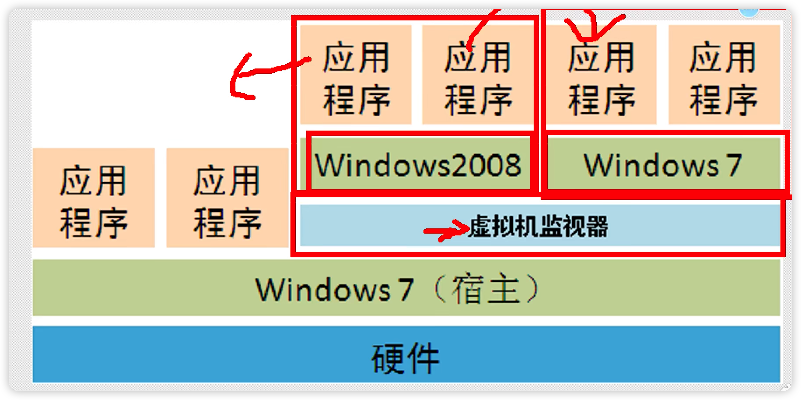
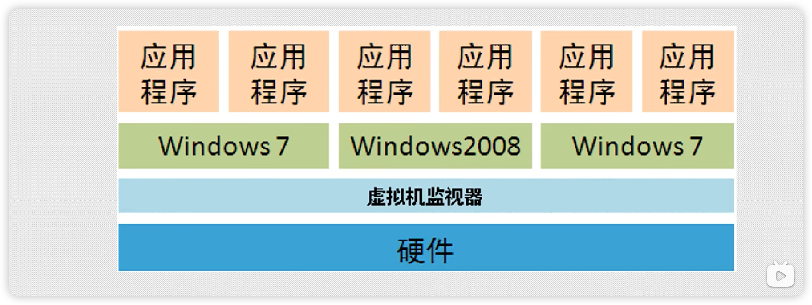
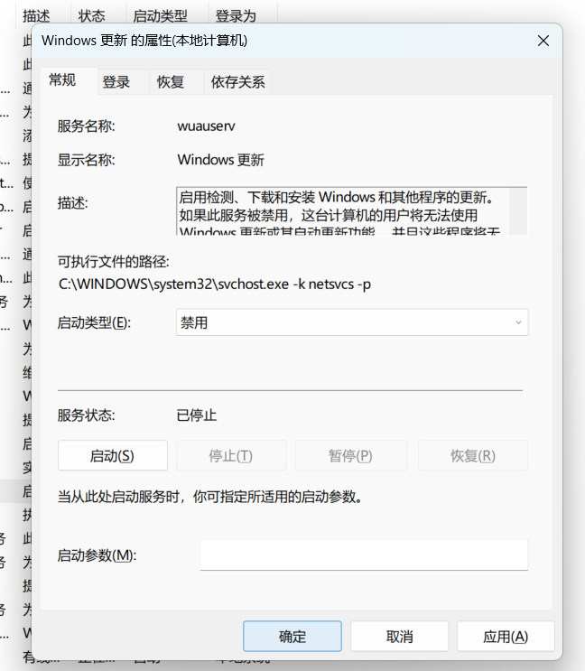
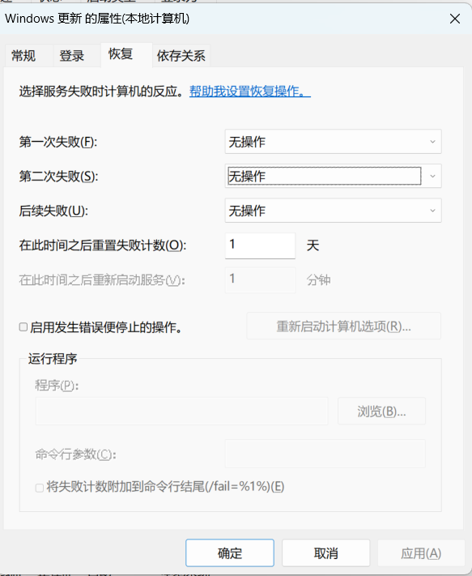

# 千锋网络安全

## 虚拟机运行机构

1.寄居架构

2.原生架构 ：公司生产环境使用

 

寄居架构（实验环境，测试环境）

- 1.虚拟机作为应用软件安装在操作系统上
- 2.可以在此应用软件上安装多个操作系统
- 3。直接安装在硬件上的系统为宿主

原生架构（生产环境）

- 1.虚拟机软件直接安装在计算机硬件上
- 2.虚拟机本省就是一个操作系统
- 在这个虚拟机中可以同时运行多个操作系统

虚拟机产品

-Vmware

- VMware Workstation(寄居架构)
- VMware vSphere(原生架构)

-微软

- Hyper-V(寄居架构)

关闭更新服务

win+r ----输入services.msc(服务管理窗口)

停止windows updated服务，并禁用

同时在恢复里，改为无操作

win+r----输入gpedit.msc

部署win xp虚拟机

准备xp系统的iso镜像文件

准备xp系统的安装位置

- a.安装win xp虚拟机
- b.优化虚拟机
  - 调出桌面图标
  - 安装vmware tools（安装驱动），重启操作（与真实机互动）
  - 磁盘管理（创建D盘分区）
  - 做快照（建议关机在做快照）

- c 克隆虚拟机--链接克隆--修改计算机名--快照
- 