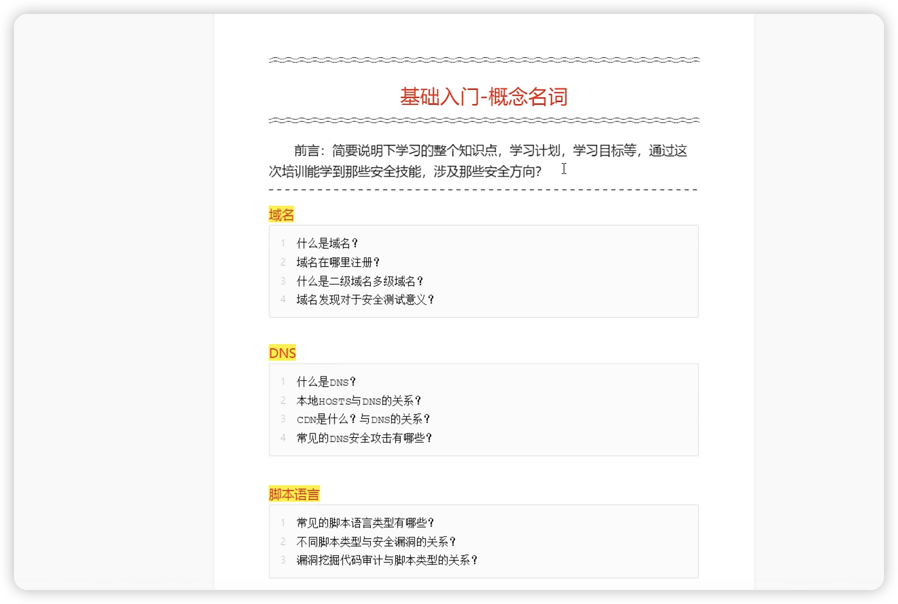
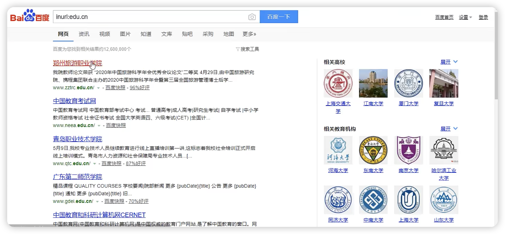
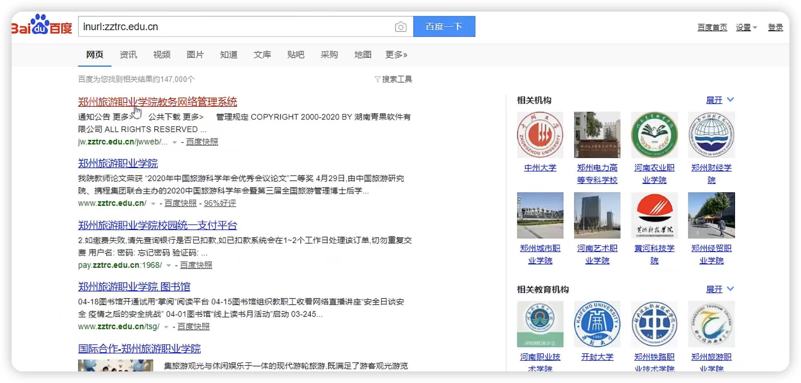
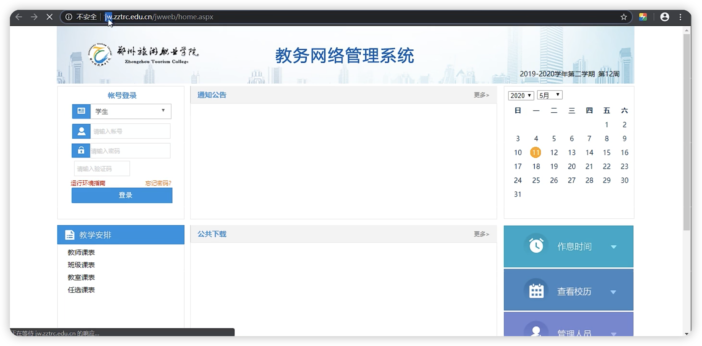
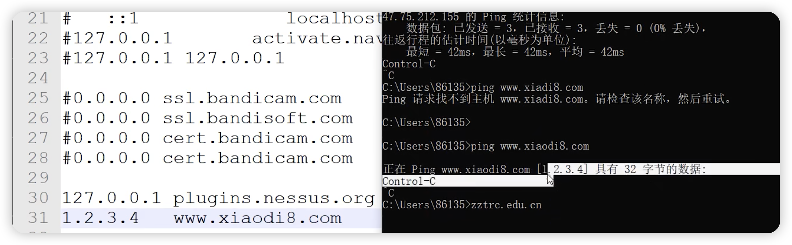

# 小迪安全

1什么是域名：域名就好比一个人的名字，  http://www.baidu.com  对于百度来说，www.baidu.com就是他的域名

2.有很多的注册网站，比如万网。如今属于阿里的。

3.什么是二级域名 就是我们输入http://www.baidu.com能访问，输入www.baidu.com也能访问，www成为顶级域名

比如news.baidu.com.这种不是www的我们称为二级域名。或者tieba.baidu.com。贴吧也就是二级域名。

那什么叫多级域名，就是前面还有，比如inurl:www:news.baidu.com。这个就叫多级域名。

4.4.inurl:edu.cn

点开第一个网页，www.zztrc.edu.cn.  

再去搜 inure:zztrc.edu.cn。发现这个有延展

点开第一个，发现这个是jw.zztrc.edu.cn

这就是二级域名和顶级域名的一个情况。那如果你想检测www.zztrc.edu.cn的情况，但你找不到突破口，你可以去找jw.zztrc.cn。就是说这两个的。那可能jw.zztrc.edu.cn的域名的解析和www.zztrc.edu.cn的IP地址是一模一样的。就是他这两个网站都是在一起的。那么如果j w.zztrc.edu.cn有漏洞，那你就可以作为突破口。

## DNS

1.域名系统(服务)协议，主要用于IP地址和域名的相互转换

2.这有一个很好的对照。在host上配置了  1.2.3.4   ->  www.xiaodi8.com       那么可以看到在ping www.xiaodi8.com的时候可以看到的内容是ip地址解析为：1.2.3.4

在ping 这个域名的时候，先去host去查看有没有对应的。如果没有，才去互联网上去获取

超级ping

