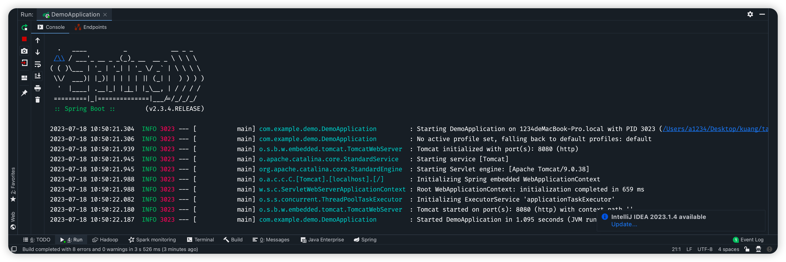

# 狂神 SpringBoot

## 微服务阶段

Javase : OOP

Mysql:持久化

html+ css+ js +jquery + 框架 ：视图，框架运用的不熟练，css不好；

Javaweb: 独立开发MVC三架构的网站了：原始

Ssm:框架：简化了我们的开发流程,配置也开始较为复杂；

**War:tomcat运行**

spring在简化：SpringBoot-jar；内嵌tomcat; 微服务架构

服务越来越多：springcloud;


新服务架构：服务网络


程序 = 数据结构 + 算法(集合框架) 程序猿

程序 = 面向对象 + 框架；码农

业务： s e rvice :userService ==> 模块！

Springmvc,controller ==> 提供接口！


用户下单 ： controller!   1s

仓库冻结：资金冻结；验证：购买成功，仓库数量减少，仓库解冻，资金解冻. 10s


# 第一个SpringBoot程序

到底多么简单

官方：提供一个快速生成的网站！idea


点解next


点击next 选择spring web


**Bug**   -> pom文件出了问题，把一些版本设置一下


```java
<?xml version="1.0" encoding="UTF-8"?>
<project xmlns="http://maven.apache.org/POM/4.0.0" xmlns:xsi="http://www.w3.org/2001/XMLSchema-instance"
         xsi:schemaLocation="http://maven.apache.org/POM/4.0.0 https://maven.apache.org/xsd/maven-4.0.0.xsd">
    <modelVersion>4.0.0</modelVersion>
    <parent>
        <groupId>org.springframework.boot</groupId>
        <artifactId>spring-boot-starter-parent</artifactId>
        <version>2.3.4.RELEASE</version>
        <relativePath/> <!-- lookup parent from repository -->
    </parent>
    <groupId>com.example</groupId>
    <artifactId>demo</artifactId>
    <version>0.0.1-SNAPSHOT</version>
    <name>demo</name>
    <description>Demo project for Spring Boot</description>
    <properties>
        <java.version>1.8</java.version>
    </properties>
    <dependencies>
        <dependency>
            <groupId>org.springframework.boot</groupId>
            <artifactId>spring-boot-starter-web</artifactId>
        </dependency>

        <dependency>
            <groupId>org.projectlombok</groupId>
            <artifactId>lombok</artifactId>
            <optional>true</optional>
        </dependency>
        <dependency>
            <groupId>org.springframework.boot</groupId>
            <artifactId>spring-boot-starter-test</artifactId>
            <scope>test</scope>
        </dependency>
    </dependencies>

    <build>
        <plugins>
            <plugin>
                <groupId>org.springframework.boot</groupId>
                <artifactId>spring-boot-maven-plugin</artifactId>
                <version>2.3.4.RELEASE</version>
                <configuration>
                    <excludes>
                        <exclude>
                            <groupId>org.projectlombok</groupId>
                            <artifactId>lombok</artifactId>
                        </exclude>
                    </excludes>
                </configuration>
            </plugin>
        </plugins>
    </build>

</project>

```

上面的这个是已经配好的

下面的是之前的配置信息

```java
<?xml version="1.0" encoding="UTF-8"?>
<project xmlns="http://maven.apache.org/POM/4.0.0" xmlns:xsi="http://www.w3.org/2001/XMLSchema-instance"
         xsi:schemaLocation="http://maven.apache.org/POM/4.0.0 https://maven.apache.org/xsd/maven-4.0.0.xsd">
    <modelVersion>4.0.0</modelVersion>
    <parent>
        <groupId>org.springframework.boot</groupId>
        <artifactId>spring-boot-starter-parent</artifactId>
        <version>2.3.4.RELEASE</version>
        <relativePath/> <!-- lookup parent from repository -->
    </parent>
    <groupId>com.example</groupId>
    <artifactId>demo</artifactId>
    <version>0.0.1-SNAPSHOT</version>
    <name>demo</name>
    <description>Demo project for Spring Boot</description>
    <properties>
        <java.version>1.8</java.version>
    </properties>
    <dependencies>
        <dependency>
            <groupId>org.springframework.boot</groupId>
            <artifactId>spring-boot-starter-web</artifactId>
        </dependency>

        <dependency>
            <groupId>org.springframework.boot</groupId>
            <artifactId>spring-boot-starter-test</artifactId>
            <scope>test</scope>
        </dependency>
        <dependency>
            <groupId>org.springframework.boot</groupId>
            <artifactId>spring-boot-autoconfigure</artifactId>
            <version>2.7.12</version>
        </dependency>
        <dependency>
            <groupId>org.springframework.boot</groupId>
            <artifactId>spring-boot</artifactId>
            <version>2.7.12</version>
        </dependency>
    </dependencies>

    <build>
        <plugins>
            <plugin>
                <groupId>org.springframework.boot</groupId>
                <artifactId>spring-boot-maven-plugin</artifactId>
                <version>2.3.4.RELEASE</version>
            </plugin>
        </plugins>
    </build>

</project>
```

对比了一下是没有这两个配置

```java
<dependency>
            <groupId>org.springframework.boot</groupId>
            <artifactId>spring-boot-autoconfigure</artifactId>
            <version>2.7.12</version>
        </dependency>
        <dependency>
            <groupId>org.springframework.boot</groupId>
            <artifactId>spring-boot</artifactId>
            <version>2.7.12</version>
        </dependency>
```

后面发现问题不在这 ，是需要进行点击install，并且双击


当我把 Delegate IDE build/run actions to maven 取消勾选后


后出现下面的情况


当勾选后 发现可以运行了




点击主类的 SpringBootApplication ->


点击SpringBootConfiguration


在点击Configuration


发现Component 组件 所以这个类，本身就是Spring的一个组件


依赖的各自作用

```java
    <dependencies>
				<!--web依赖：tomcat，dispatcherService,xml...-->
        <dependency>
            <groupId>org.springframework.boot</groupId>
            <artifactId>spring-boot-starter-web</artifactId>
        </dependency>
      
<!--spring-boot-starter所有的spring-boot依赖都是使用这个开头的     -->

				<!--单元测试-->
        <dependency>
            <groupId>org.springframework.boot</groupId>
            <artifactId>spring-boot-starter-test</artifactId>
            <scope>test</scope>
        </dependency>
      
        <dependency>
            <groupId>org.springframework.boot</groupId>
            <artifactId>spring-boot-autoconfigure</artifactId>
            <version>2.7.12</version>
        </dependency>
        <dependency>
            <groupId>org.springframework.boot</groupId>
            <artifactId>spring-boot</artifactId>
            <version>2.7.12</version>
        </dependency>
    </dependencies>

    <build>
        <!--打jar包插件-->
        <plugins>
            <plugin>
                <groupId>org.springframework.boot</groupId>
                <artifactId>spring-boot-maven-plugin</artifactId>
                <version>2.3.4.RELEASE</version>
            </plugin>
        </plugins>
    </build>
```


更改端口号 resources -> application.properties

```java
#更改项目的端口号
server.port=8081
```

 修改图标 在resources 上 新建一个banner.txt的文本。然后将下面的穿上去

```java
//                          _ooOoo_                               //
//                         o8888888o                              //
//                         88" . "88                              //
//                         (| ^_^ |)                              //
//                         O\  =  /O                              //
//                      ____/`---'\____                           //
//                    .'  \\|     |//  `.                         //
//                   /  \\|||  :  |||//  \                        //
//                  /  _||||| -:- |||||-  \                       //
//                  |   | \\\  -  /// |   |                       //
//                  | \_|  ''\---/''  |   |                       //
//                  \  .-\__  `-`  ___/-. /                       //
//                ___`. .'  /--.--\  `. . ___                     //
//              ."" '<  `.___\_<|>_/___.'  >'"".                  //
//            | | :  `- \`.;`\ _ /`;.`/ - ` : | |                 //
//            \  \ `-.   \_ __\ /__ _/   .-` /  /                 //
//      ========`-.____`-.___\_____/___.-`____.-'========         //
//                           `=---='                              //
//      ^^^^^^^^^^^^^^^^^^^^^^^^^^^^^^^^^^^^^^^^^^^^^^^^^^        //
//            佛祖保佑       永不宕机     永无BUG                  //
```


# 原理初探

自动配置：

Pom.xml

- Spring-boot-dependencies:核心依赖在父工程中
- 我们子啊写或者引入一些springboot依赖的时候，不需要指定版本，就因为有这些版本仓库


启动器

```xml
       <dependency>-->
            <groupId>org.thingsboard</groupId>-->
            <artifactId>springfox-boot-starter</artifactId>-->
       </dependency>-->
```


- 启动器：说白了就是springboot的启动场景；
- 比如spring-boot-start-web,他就会帮我们自动导入web环境所有的依赖
- s pringboot会将所有的功能场景，变成一个个的启动器
- 如果我们要使用什么功能，就只需要找到对应的启动器 `starter`


主程序

```java
@SpringBootApplication ：标注这个类是一个springboot的应用；
  
//将springboot应用启动
public static void main(String[] args) {
        SpringApplication.run(DemoApplication.class, args);
    }
```


注解

```java
@SpringBootConfiguration  springboot的配置
	@Configuration:spring配置类
	@Component:说明这也是一个spring组件
	
	
@EnableAutoConfiguration ：自动配置
	@AutoConfigurationPackage：自动配置包
		@Import(AutoConfigurationPackages.Regiestrar.class) ：自动配置`包注册`
	@Import(AutoConfigurationImportSelector.class) ：自动配置导入选择
	
	
//获取所有的配置
List<String> configuration = getCandidateConfigurations(annotationMetadata,attributes);

```


获取候选的配置

```java
protected List<String> getCandidateConfigurations(AnnotationMetadata metadata, AnnotationAttributes attributes) {
        List<String> configurations = SpringFactoriesLoader.loadFactoryNames(this.getSpringFactoriesLoaderFactoryClass(), this.getBeanClassLoader());
        Assert.notEmpty(configurations, "No auto configuration classes found in META-INF/spring.factories. If you are using a custom packaging, make sure that file is correct.");
        return configurations;
    }
```


META-INF/spring.factories:自动配置的核心文件

```java
Properties properties = PropertiesLoaderUtils.loadProperties(resource);
所有资源加载到配置类中！
```


结论：springboot所有的自动配置都在启动类中被扫描并加载：spring.factories所有的自动配置类都在这里面，但是不一定生效，要判断条件是否成立，只要导入了对应的start，就有对应的启动器，有了启动器，我们自动配置就会生效，然后就配置成功！


1.spring boot在启动的时候，从类路径下 /META-INF/spring.factories获取指定位置；

2.将这些自动配置的类导入容器，自动配置就会生效，帮我们进行自动配置

3.以前我们需要自动配置的东西，现在springboot帮我们做了

4.整个javaEE,解决方案和自动配置都在spring-boot-autoconfigure-2.3.4.RELEASE.jar 这个包下

5.他就把所有需要导入的组件，以类名的方式返回，这些组件将会被添加到容器；（根据类名吧包导入进去）

6.容器中也会存在非常多的xxxAutoConfiguration的文件（@Bean），就是这些类给容器中导入了这个场景需要的所有组件;并自动配置，@configuration, javaConfig!

7.有了自动配置类，就免去了我们手动编写配置文件的配置工作！


 [自动配置原理分析.xmind](../../../Documents/自动配置原理分析.xmind) 


关于springboot你的理解：

- 自动装配
- Run()。需要自己去找一些源码分析的博客
  - 1.判断应用的类型是普通的项目还是web项目
  - 2.查找并架子啊所有可用初始化器，设置到initializers属性中
  - 3.找出所有的应用程序监听器，设置到listeners属性中
  - 4.推断并设置main方法的定义类，找到运行的主类


# springboot配置

全面接管springmvc的配置。实操！

yaml十分强大，对比properties只能写键值对

```yaml
# 普通的key-value
#对空格的要求十分高

#注入到我们的配置类中

name: qingjiang

#对象
student:
  name: qingjaing
  age: 3

#行内写法
student: {name: qingjiang,age: 3}

#数组
pets:
  - cat
  - dog
  - pig

pets: [cat,dog,pig]
```


yaml可以直接给实体类父类赋值


```java
package com.kuang.pojo;

import org.springframework.beans.factory.annotation.Value;
import org.springframework.boot.context.properties.ConfigurationProperties;
import org.springframework.stereotype.Component;

import java.util.Date;
import java.util.List;
import java.util.Map;

@Component
@ConfigurationProperties(prefix = "person")
public class Person {

//    Person{name='qinjiang',
//    age=3,
//    happy=false,
//    birth=Sat Nov 02 00:00:00 CST 2019,
//    maps={k1=v1, k2=v2},
//    lists=[code, music, girl],
//    dog=Dog{name='旺财', age=3}}
    private String name;
    private Integer age;
    private Boolean happy;
    private Date birth;
    private Map<String,Object> maps;
    private List<Object> lists;
    private Dog dog;
    public Person(){

    }

    public Person(String name, Integer age, Boolean happy, Date birth, Map<String, Object> maps, List<Object> lists, Dog dog) {
        this.name = name;
        this.age = age;
        this.happy = happy;
        this.birth = birth;
        this.maps = maps;
        this.lists = lists;
        this.dog = dog;
    }

    public String getName() {
        return name;
    }

    public void setName(String name) {
        this.name = name;
    }

    public Integer getAge() {
        return age;
    }

    public void setAge(Integer age) {
        this.age = age;
    }

    public Boolean getHappy() {
        return happy;
    }

    public void setHappy(Boolean happy) {
        this.happy = happy;
    }

    public Date getBirth() {
        return birth;
    }

    public void setBirth(Date birth) {
        this.birth = birth;
    }

    public Map<String, Object> getMaps() {
        return maps;
    }

    public void setMaps(Map<String, Object> maps) {
        this.maps = maps;
    }

    public List<Object> getLists() {
        return lists;
    }

    public void setLists(List<Object> lists) {
        this.lists = lists;
    }

    public Dog getDog() {
        return dog;
    }

    public void setDog(Dog dog) {
        this.dog = dog;
    }

    @Override
    public String toString() {
        return "Person{" +
                "name='" + name + '\'' +
                ", age=" + age +
                ", happy=" + happy +
                ", birth=" + birth +
                ", maps=" + maps +
                ", lists=" + lists +
                ", dog=" + dog +
                '}';
    }
}
```

dog类

```java
package com.kuang.pojo;

import org.springframework.beans.factory.annotation.Value;
import org.springframework.stereotype.Component;

@Component  //把这些添加到spring组件中去
public class Dog {
    @Value("旺财")
    private String name;
    @Value("3")
    private Integer age;

    public Dog(){

    }
    public Dog(String name,Integer age){
        this.name = name;
        this.age = age;
    }

    public String getName() {
        return name;
    }

    public void setName(String name) {
        this.name = name;
    }

    public Integer getAge() {
        return age;
    }

    public void setAge(Integer age) {
        this.age = age;
    }

    @Override
    public String toString() {
        return "Dog{" +
                "name='" + name + '\'' +
                ", age=" + age +
                '}';
    }
}
```

Application.yaml

```yaml
person:
  name: qinjiang
  age: 3
  happy: false
  birth: 2019/11/02
  maps: {k1: v1,k2: v2}
  lists:
    - code
    - music
    - girl
  dog:
    name: 旺财
    age: 3
```


```java
/*
@ConfigurationProperties作用：
将配置文件中配置的每一个属性的值，映射到这个组件中；
告诉Springboot将本类中的所有属性和配置文件中相关的配置绑定
参数 prefix ="person"：将配置文件中的person下面的所有属性--对应
只有这个组件是容器中的组件，才能使用容器提供的@ConfigurationProperties功能
**/
```


在编写properties配置文件在写中文的时候，就有乱码，勾选上，防止乱码。所以建议写yaml


## 加载指定的配置文件

1.先把@ConfigurationProperties(prefix = "person")给注销了

2.在resource文件夹里面新建一个文件 ，我这里自己定义一个 qinjiang.proiperties 的文件。

```
name=kuangsheng
```

3.在实体类上写好配置文件的值

```
//SPEL表达式取出配置文件的值
@Value("${name}")
```

4.

```
//javaCibfig 绑定我们配置文件的值，可以采取这些方式！
//加在指定的配置文件
@PropertySource(value = "classpath:qinjiang.properties")
```

```java
package com.kuang.pojo;

import org.springframework.beans.factory.annotation.Value;
import org.springframework.boot.context.properties.ConfigurationProperties;
import org.springframework.context.annotation.PropertySource;
import org.springframework.stereotype.Component;

import java.util.Date;
import java.util.List;
import java.util.Map;

@Component
@ConfigurationProperties(prefix = "person")

//javaCibfig 绑定我们配置文件的值，可以采取这些方式！
//加在指定的配置文件
//@PropertySource(value = "classpath:qinjiang.properties")
public class Person {
    //SPEL表达式取出配置文件的值
    @Value("${name}")
    private String name;
    private Integer age;
    private Boolean happy;
    private Date birth;
    private Map<String,Object> maps;
    private List<Object> lists;
    private Dog dog;
    public Person(){

    }

    public Person(String name, Integer age, Boolean happy, Date birth, Map<String, Object> maps, List<Object> lists, Dog dog) {
        this.name = name;
        this.age = age;
        this.happy = happy;
        this.birth = birth;
        this.maps = maps;
        this.lists = lists;
        this.dog = dog;
    }

    public String getName() {
        return name;
    }

    public void setName(String name) {
        this.name = name;
    }

    public Integer getAge() {
        return age;
    }

    public void setAge(Integer age) {
        this.age = age;
    }

    public Boolean getHappy() {
        return happy;
    }

    public void setHappy(Boolean happy) {
        this.happy = happy;
    }

    public Date getBirth() {
        return birth;
    }

    public void setBirth(Date birth) {
        this.birth = birth;
    }

    public Map<String, Object> getMaps() {
        return maps;
    }

    public void setMaps(Map<String, Object> maps) {
        this.maps = maps;
    }

    public List<Object> getLists() {
        return lists;
    }

    public void setLists(List<Object> lists) {
        this.lists = lists;
    }

    public Dog getDog() {
        return dog;
    }

    public void setDog(Dog dog) {
        this.dog = dog;
    }

    @Override
    public String toString() {
        return "Person{" +
                "name='" + name + '\'' +
                ", age=" + age +
                ", happy=" + happy +
                ", birth=" + birth +
                ", maps=" + maps +
                ", lists=" + lists +
                ", dog=" + dog +
                '}';
    }
}
```

yaml比properties要高级很多，yaml可以给属性加${random.int}

```yaml
person:
  name: qinjiang${random.int}
  age: ${random.int}
  happy: false
  birth: 2019/11/02
  maps: {k1: v1,k2: v2}
  lists:
    - code
    - music
    - girl
  dog:
    name: ${person.hello:hello}_旺财
    age: 3
```

结果是：

```java
Person{name='qinjiang2016402791', age=-363467300, happy=false, birth=Sat Nov 02 00:00:00 CST 2019, maps={k1=v1, k2=v2}, lists=[code, music, girl], dog=Dog{name='hello_旺财', age=3}}
```

如果hello存在

```
hello: happy
```

结果是

```java
Person{name='qinjiang-223087364', age=1079181209, happy=false, birth=Sat Nov 02 00:00:00 CST 2019, maps={k1=v1, k2=v2}, lists=[code, music, girl], dog=Dog{name='happy_旺财', age=3}}
```


# JSR303校验

松散绑定  yaml上是first-name，而DOG是firstName


如果说，我们专门编写了一个javabean来和配置文件进行映射，就直接使用 @ConfigurationProperties，不要犹豫


**发现一个神奇现象，就是加了@Validated,他会报错，神奇。去了这个注释以后就好了。**


选择配置文件  根据application后面跟着的 -dev,-test等等


可见properties需要写3个文件

但yaml只需要写一个

```java
server:
  port: 8081

---
server:
  port: 8082
spring:
  profiles: dev

---
server:
  port: 8083
spring:
  profiles: test
```

如果需要激活哪个,只需要在配置里面写上

```java
spring:
  profiles:
    active:dev
```


如图


# 自动配置原理再理解


# springboot web开发

Jar:webapp!

## 自动装配

​	springboot到底帮我们配置了什么？我们能不能进行修改？能修改哪些东西？能不能扩展？

- xxxAutoConfiguration... 向容器中自动配置组件
- xxxProperties:自动配置类，装配配置文件中自定义的一些内容！


要解决的问题：

- 导入静态资源,....
- 首页
- Jsp,模版引擎Thymeleaf
- 装配扩展springmvc
- 增删改查
- 拦截器
- 国际化！


# 静态资源

```java
 public void addResourceHandlers(ResourceHandlerRegistry registry) {
   
            if (!this.resourceProperties.isAddMappings()) {
                logger.debug("Default resource handling disabled");
            } else {
                Duration cachePeriod = this.resourceProperties.getCache().getPeriod();
                CacheControl cacheControl = this.resourceProperties.getCache().getCachecontrol().toHttpCacheControl();
                if (!registry.hasMappingForPattern("/webjars/**")) {
                    this.customizeResourceHandlerRegistration(registry.addResourceHandler(new String[]{"/webjars/**"}).addResourceLocations(new String[]{"classpath:/META-INF/resources/webjars/"}).setCachePeriod(this.getSeconds(cachePeriod)).setCacheControl(cacheControl));
                }

                String staticPathPattern = this.mvcProperties.getStaticPathPattern();
                if (!registry.hasMappingForPattern(staticPathPattern)) {
                    this.customizeResourceHandlerRegistration(registry.addResourceHandler(new String[]{staticPathPattern}).addResourceLocations(WebMvcAutoConfiguration.getResourceLocations(this.resourceProperties.getStaticLocations())).setCachePeriod(this.getSeconds(cachePeriod)).setCacheControl(cacheControl));
                }

            }
        }
```

总结：

​	1.在·springboot中，我们可以使用以下方式处理静态资源

	  * webjars localhost:8080/webjars/
	  * public ,static,  /**.  Resources  `localhost:8080/`

2.优先级：resources. > static(默认) >public 


# 首页如何定制

将首页放入resource的目录中


# 模版引擎

结论：只需要使用thyme leaf,只需要导入对应的依赖就可以了！我们将thml页面放在我们的templates目录下即可

```java
public static final String DEFAULT_PREFIX = "classpath:/templates/";
public static final String DEFAULT_SUFFIX = ".html";
```


需要添加依赖

```xml
<dependency>
            <groupId>org.springframework.boot</groupId>
            <artifactId>spring-boot-starter-thymeleaf</artifactId>
</dependency>
```

可能是刚编译器没反应过来，我发现即使去了这个依赖，也能访问 ，擦，妈的

**错误: 找不到或无法加载主类 com.kuang.Springboot03WebApplication。   可能重构一下就好了**

```java
package com.kuang.config;

import org.springframework.context.annotation.Bean;
import org.springframework.context.annotation.Configuration;
import org.springframework.web.servlet.View;
import org.springframework.web.servlet.ViewResolver;
import org.springframework.web.servlet.config.annotation.WebMvcConfigurer;

import java.util.Locale;

//扩展springmvc           dispatcherServlet
//如果你想自定义一些定制化的功能，只需要写这个组件，然后将它交给springboot,springboot就会帮我们自动装配
@Configuration
public class MyMvcConifg implements WebMvcConfigurer {

// public interface ViewResolver  实现了视图解析器接口的类，我们就可以把它看作视图解析器

    @Bean
    public  MyViewResolver myViewResolver(){
        return new MyViewResolver();
    }

    //自定义了一个自己的视图解析器MyViewResolver
    public static class MyViewResolver implements ViewResolver {
        @Override
        public View resolveViewName(String s, Locale locale) throws Exception {
            return null;
        }
    }
}
//自定义一个视图解析器，然后放入bean中
```


在springboot中，有非常多的xxxConfiguration帮助我们进行扩展配置，只要看见了这个东西，我们就要注意了


```xml
<!DOCTYPE html>
<html lang="en" xmlns:th="http://www.thymeleaf.org">
<head>
    <meta charset="UTF-8">
    <title>Title</title>
</head>
<body>
<!--所有的html元素都可以被thymeleaf接管： th:元素名-->
<div th:text="${msg}"></div>
<div th:utext="${msg}"></div>

<hr>
<h3 th:each="user:${users}" >[[${user}}]]</h3>
<!--<h3 th:each="user:${users}" th:text="${user}"></h3>-->
</body>
</html>
```


```java
package com.kuang.controller;

import org.springframework.stereotype.Controller;
import org.springframework.ui.Model;
import org.springframework.web.bind.annotation.GetMapping;
import org.springframework.web.bind.annotation.RequestMapping;

import java.util.Arrays;

//在templates目录下的所有页面，只能通过controller来跳转
//这个需要模版引擎的支持！ thymeleaf
@Controller
public class IndexController {
    @RequestMapping("/test")
    public String test(Model model){
        model.addAttribute("msg","<h1>hello,springboot</h1>");

        model.addAttribute("users", Arrays.asList("qinjiang","kuangshen"));
        return "test";
    }
}
```


首页配置：1.所有页面的静态资源都需要使用thymeleaf接管；

​					2.url: @{}

2.页面国际化:1.我们需要配置i18n文件

​						2.我们如果需要在项目中进行按钮自动切换，我们需要自定义一个组件.  LocaleResolver

​						3.记得将自己写的组件配置到spring容器中 @Bean

​						4,#{}

3.登陆+拦截器

4.员工列表展示

​	1。提取公共页面	

```
th:fragment="topbar"
```

```
th:fragment="sidebar"
```

​	如果要传递参数，可以直接使用()传参，接受判断即可

​	2.列表循环展示

5.添加员工

​	1.按钮提交

​	2.跳转到添加页面

​	3.添加员工成功

​	4.返回首页

6.CRUD搞定

7.404


前端：

- 模版：别人写好的，我们拿来改成自己需要的
- 框架：组件：自己手动组合拼接！ Bootstrap,layui,semantic-ui.  


1.前端搞定，页面你长什么样子：数据

2.设计数据库（数据库设计难点）

3.前端让他能够自动运行，独立化工程

4.数据接口如何对接·：json ,对象 all in one

5.前后端联调测试


1.有一套自己熟悉的后台模版：工作必要。x-admin

2.前端页面：至少自己能够通过前端框架，组合出来一个网站

​		-index

​		-about

​		-blog

​		-post

​		-user

3.让网站自己跑起来


# mybatis

整合包

Mybatis-spring-boot-starter

1.导入包

2.配置文件

3.mybatis配置

4.编写sql

5.业务层编写dao层

6.contreoller调用service层


# SpringSecurity(安全)

