# 王道计算机操作系统

一台电脑的诞生

Step1:厂家组装一台裸机

Step2:出售前安装操作系统

Step3:用户安装应用程序（eg:QQ）

Step4:使用QQ聊天

裸机（纯硬件） 裸机：包含cpu,内存，硬盘，主板等

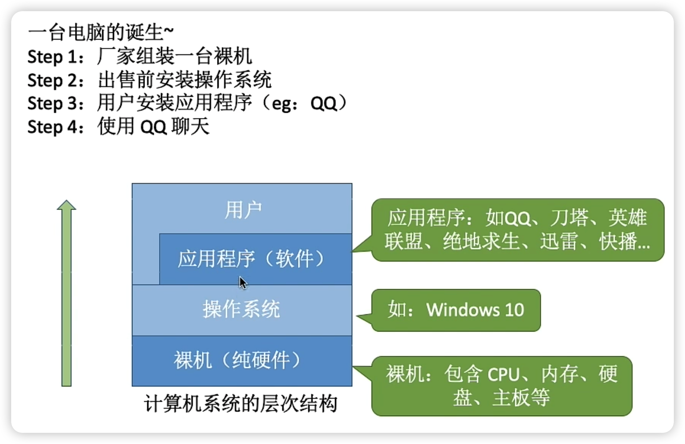

操作系统即管理了硬件资源也管理了软件资源

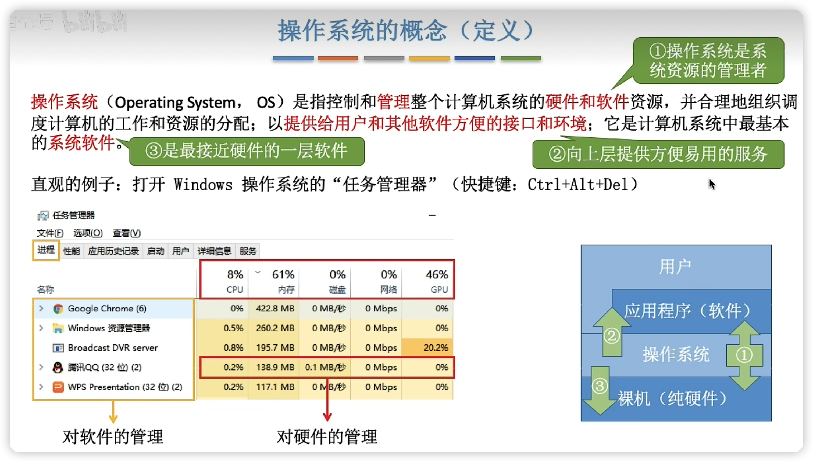

补充知识：执行一个程序前需要将该程序放到内存中，才能被CPU处理。

操作系统的功能和目标 --作为系统资源的管理者

用qq和朋友视屏聊天的过程

Step1:在文件夹中找到qq安装位置。  （逐层打开文件夹，找到qq.exe这个程序（可执行文件）的存放位置）

Step2:双击打开qq.exe。                     （需要把该程序相关的数据放入内存）

Step3:qq程序正常运行						（对应的程序被处理机（cpu）处理）

Step4:开始和朋友视屏聊天				（需要将摄像头设备分配给进程）

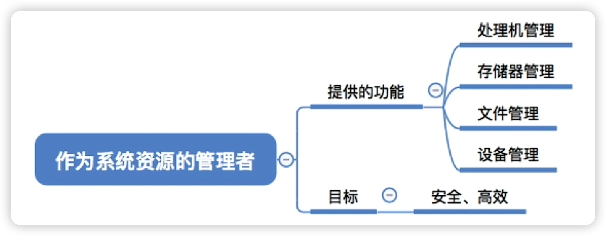

硬件只听得懂二进制指令，如01001100101010101010101 硬件对外暴露了“丑陋”，不友好的交互接口

在硬件之上安装了操作系统，操作系统对外暴露了“美丽”，友好的交互接口

我们只需要告诉操作系统，我们想要得到服务就可以，操作系统会把用户的命令，需求翻译成二进制，来告诉硬件，由硬件来执行操作

这是很典型的封装思想：操作系统把一些丑陋的硬件功能封装成简单易用的服务，使用户能更方便的使用计算机，用户无需关心底层硬件的原理，只需要对操作系统发出命令即可

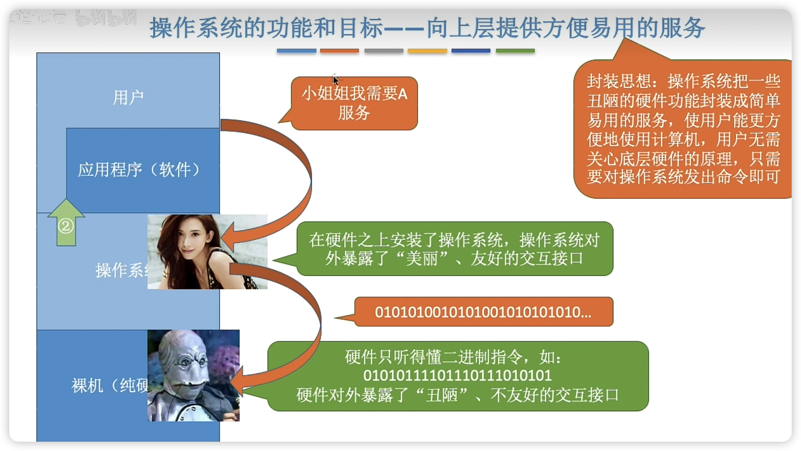

操作系统的功能和目标--向上层提供方便易用的服务

GUI：图形化用户接口

用户可以在使用形象的图形界面进行操作，而不是需要记忆复杂的命令，参数

例子：在windows操作系统中，删除一个文件只需要把文件拖拽到回收站即可

早期的。联机命令接口实例（windows系统） 联机命令接口=***交互式***命令接口

Step1:win+r

Step2:输入cmd,按回车，打开命令解释器

Step3:尝试使用time命令

脱机命令接口实例（windows） 脱机命令接口=***批处理***命令接口。          			特点：用户说一堆·，系统跟着做一堆

使用windows系统的搜素功能，搜索C盘中的*.bat文件，用记事本任意打开一个

程序接口：可以在程序中进行系统调用来使用程序接口。普通用户不能直接使用程序接口，只能通过程序代码***间接使用***。

如：写c语言“hello world”程序时，在printf函数的底层就使用到了操作系统提供的显示相关的  “系统调用”

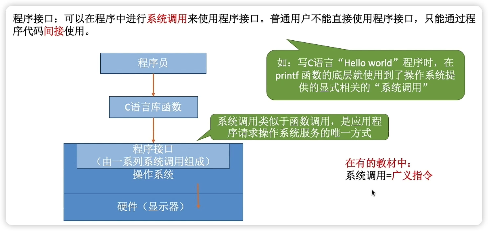

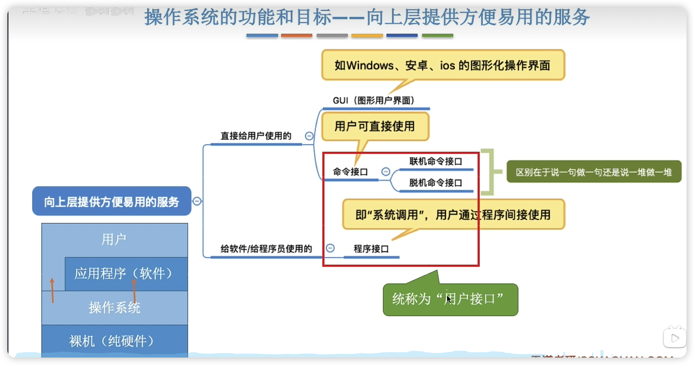

操作系统最为最接近硬件的层次，需要实现对硬件机器的扩展

没有任何软件支持的计算机成为裸机，在裸机上安装的操作系统，可以提供资源管理功能和方便用户的服务功能，将裸机改造成功能更强，使用更方便的机器

通常把覆盖了软件的机器称为扩充机器，又称为虚拟机

类比汽车：

发动机--只会转；轮胎--只会滚；

在原始的硬件机器上覆盖一层传动系统--让发动机带着轮子转--使原始的硬件机器得到扩展

操作系统对硬件机器的扩展：将cpu,没存，磁盘，显示器，键盘等硬件合理组织起来，让各种硬件能相互协调配合，实现更多复杂的功能

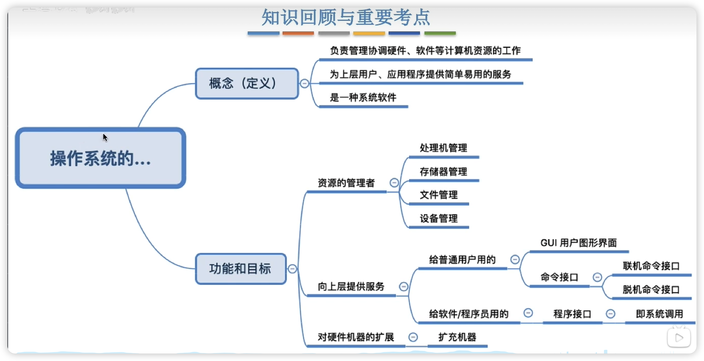

## 操作系统的特征

并发：指两个或多个时间在同一时间间隔内发生。这些事件宏观上是同时发生的，但微观上是交替发生的。

常考易混概念--并行：指两个或多个事件在同一时刻同时发生。

并发VS并行

Eg:假设小渣和老渣每人有两个女朋友。任务一：和一号约会；任务二：和二号约会....

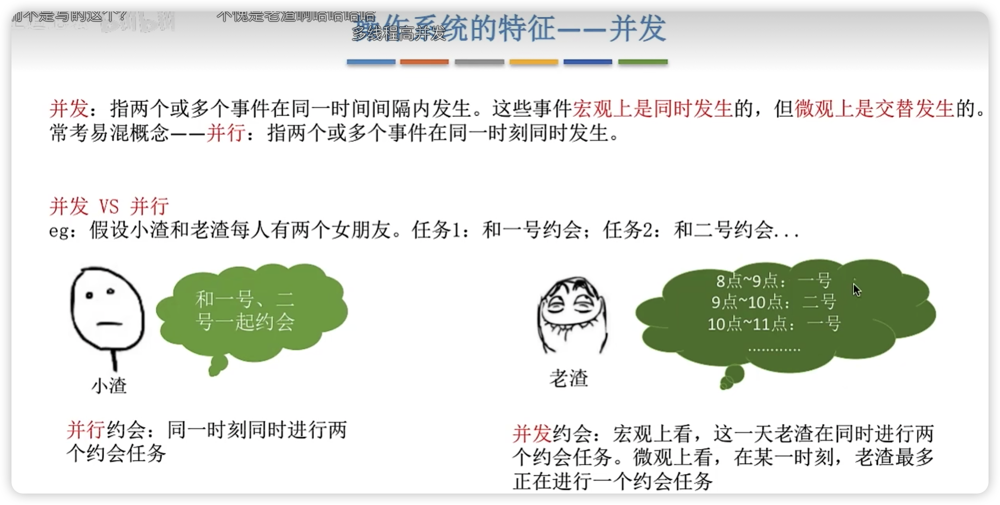

### 操作系统的并发性

并发：指两个或多个事件在同一时间间隔内发生。这些事件宏观上是同时发生的，但微观上是交替发生的

操作系统的并发性指计算机系统中  “同时” 运行多个程序，这些程序宏观上看是同时运行着，而微观上看是交替运行的。

操作系统就是伴随着“多道程序技术”而出现的。因此，操作系统和程序并发是一起诞生的。

***注意（重要考点）***

单核cpu同一时刻只能运行一个程序，各个程序只能并发地执行

多核CPU同一时刻可以同时执行多个程序，多个程序可以并发地执行。

比如Intel的第八代i3处理器就是4核CPU，意味着可以并行地执行4个程序。（即使是对于4核CPU来说，只要有4个以上的程序需要“同时”运行，那么并发性依然是必不可少的，因此并发性是操作系统的一个最基本的特征）

 

### 操作系统的共享

共享即资源共享，是指系统中的资源可供内存中多个并发执行的进程共同使用。

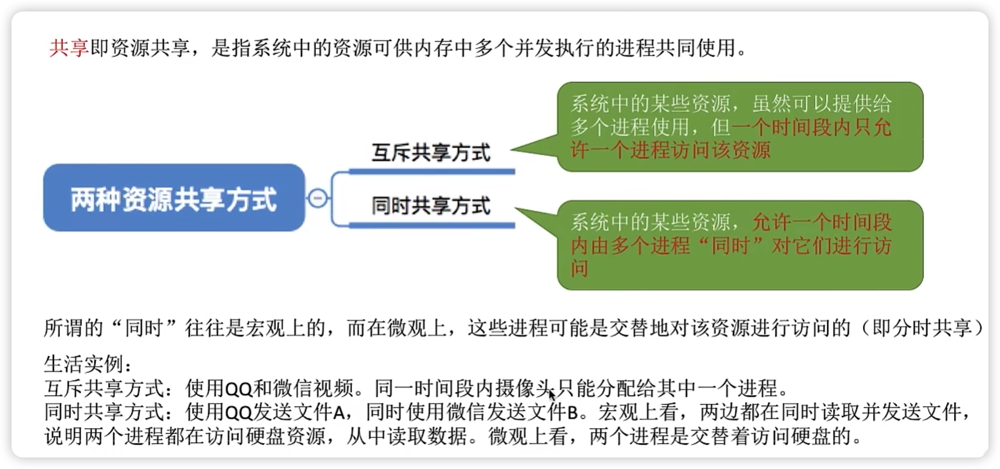

### 并发和共享的关系

并发性指计算机系统中同时存在着多个运行着的程序

共享性是指系统中的资源可供内存中多个并发执行的进程共同使用。

通过上述例子看并发与共享的关系：

使用QQ发送文件A，同时使用微信发送文件B。

1.两个进程正在并发执行（并发性）

2.需要共享地访问硬盘资源（共享性）

如果失去并发性，则系统只有一个程序正在运行，则共享性失去了存在的意义

如果失去共享性，则qq和微信不能同时访问硬盘资源，就无法实现同时发送文件，也就无法并发。

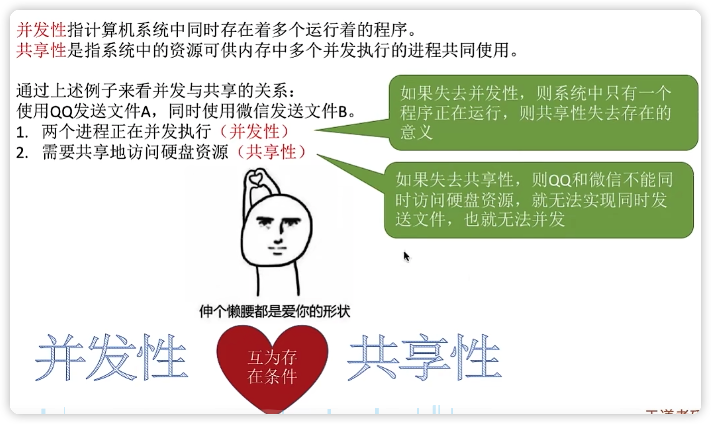

### 虚拟

虚拟是指把一个物理上的实体变成若干个逻辑上的对应物。物理实体（前者）是实际存在的。而逻辑上对应物（后者）是用户感受到的。

Eg:

一个程序需要放入内存并给他分配CPU才能执行

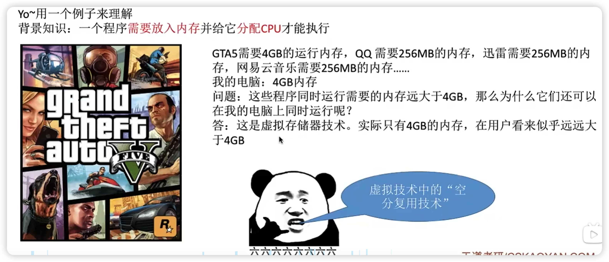

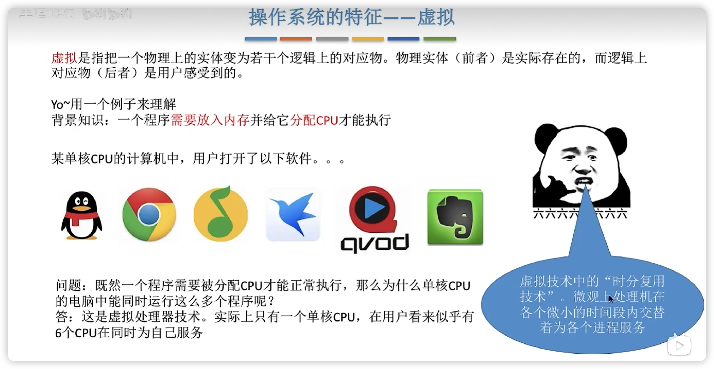

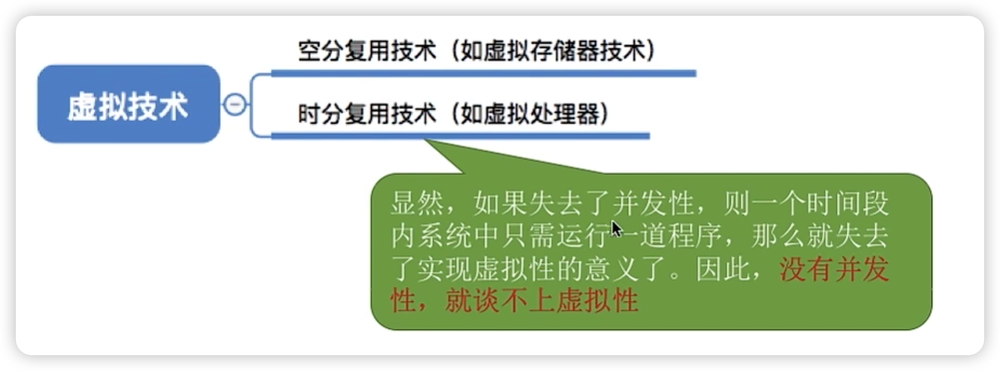

### 异步性

异步是指，在多道程序环境下，允许多个程序并发执行，但由于资源有限，进程的执行不是一贯到底的，而是走走停停，以不可预知的速度向前推进，这就是进程的异步性

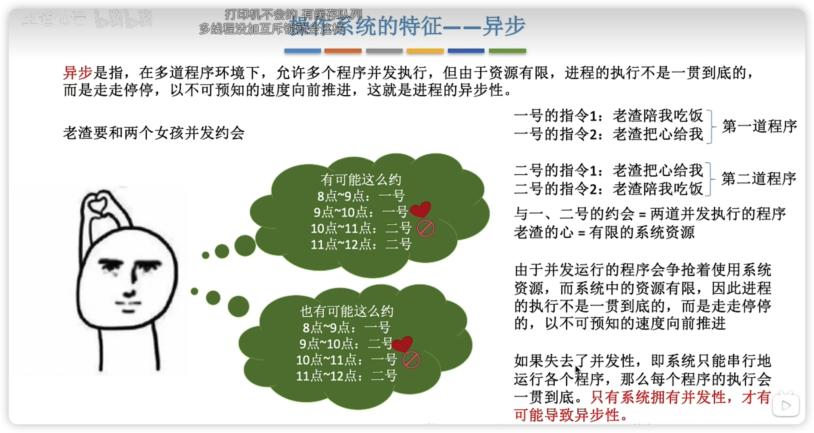

### 知识点总结

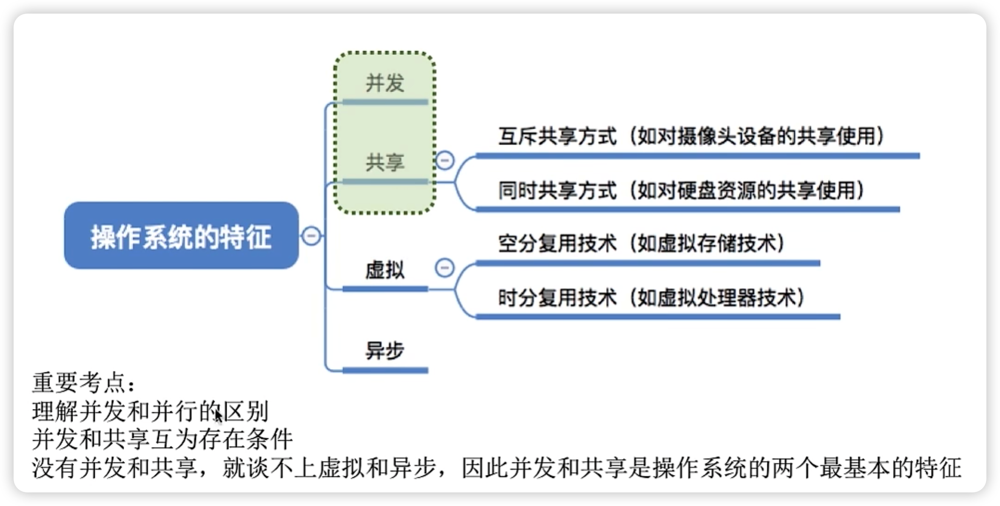

## 操作系统的发展与分类

学习提醒：要重点关注和理解各类操作系统主要想解决的是什么问题，各自的优缺点

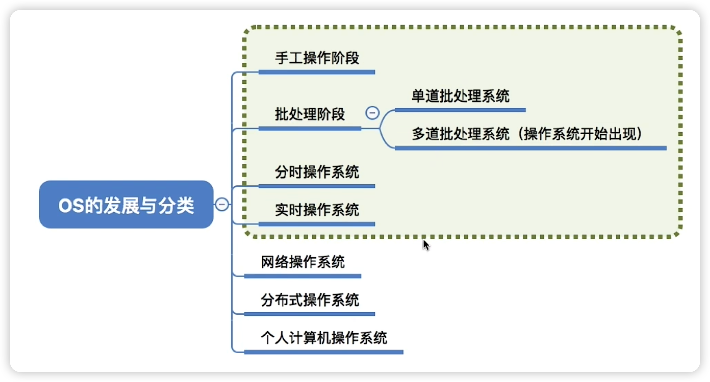

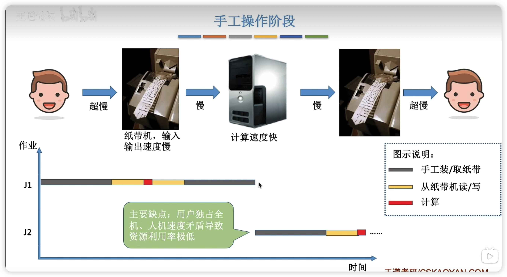

### 批处理阶段--单道批次处理系统

引入脱机输入/输出技术（用外围机+磁带完成），并由监督程序负责控制作业的输入，输出

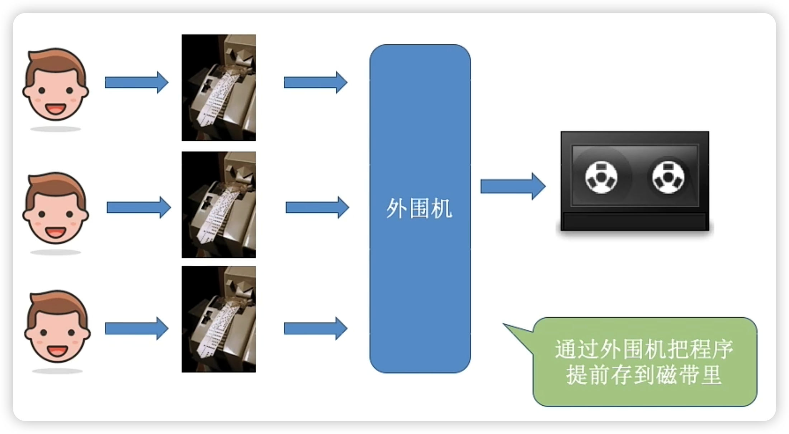

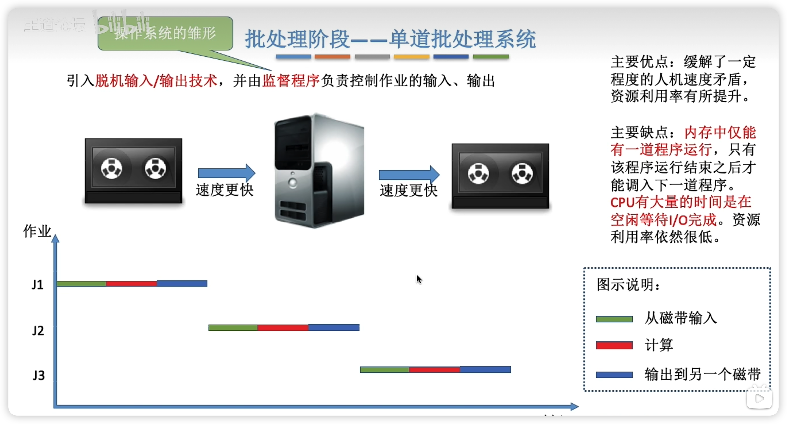

### 多道批处理系统

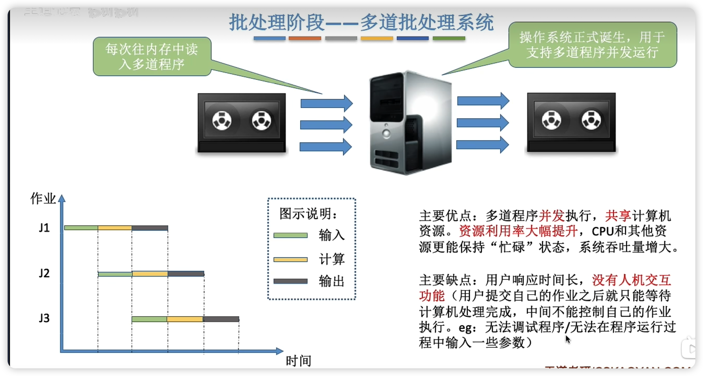

### 分时操作系统

分时操作系统：计算机以时间片为单位轮流为各个用户/作业服务。各个用户可通过终端与计算机进行交互。

主要优点：用户请求可以被及时响应，解决了人机交互问题。允许多个用户同时使用一台计算机，并且用户对计算机的操作相互独立，感受不到别人的存在。

主要缺点：不能优先处理一些紧急任务。操作系统对各个用户/作业都是完全公平的，循环地为每个用户/作业服务一个时间片，不区分任务的紧急性。

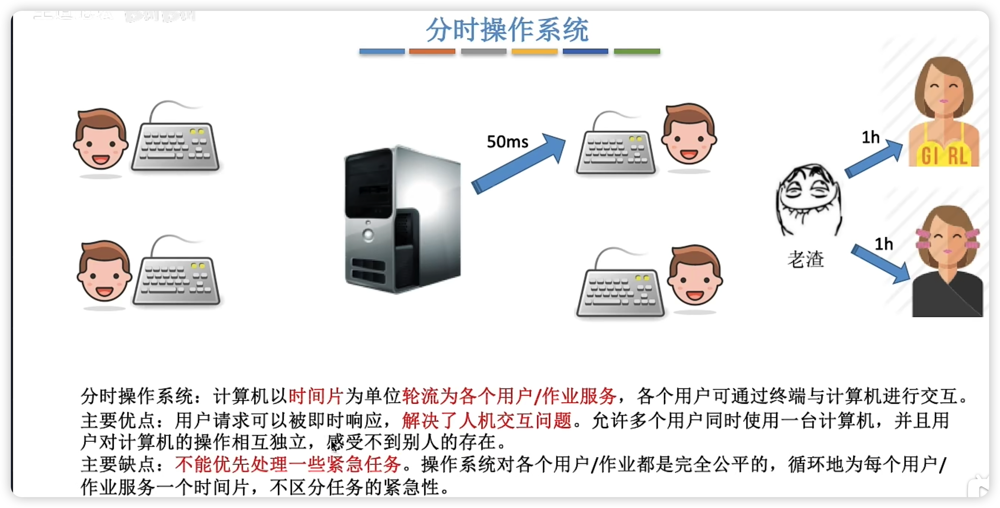

### 实时操作系统

实时操作系统：

主要优点：能够优先响应一些紧急任务，某些紧急任务不需时间片排队

在实时操作系统的控制下，计算机系统接受到外部信号后及时处理，并且要在严格的时限内处理完事件。实时操作系统的主要特点是及时性和可靠性

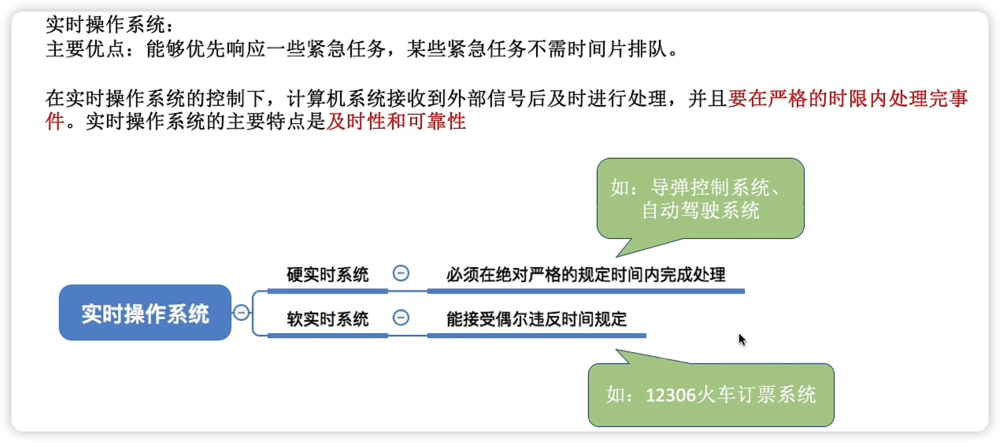

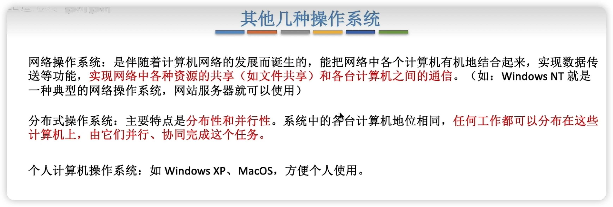

## 操作系统的运行机制

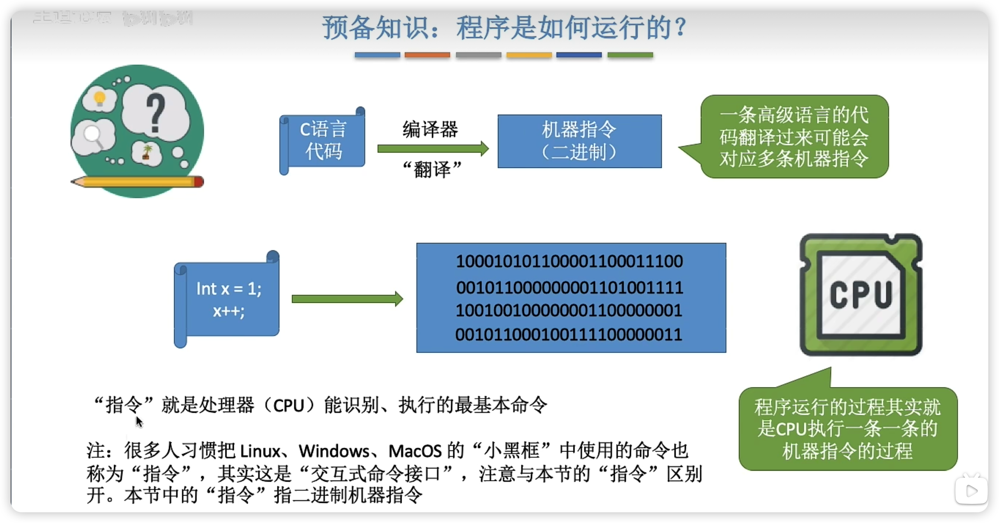
