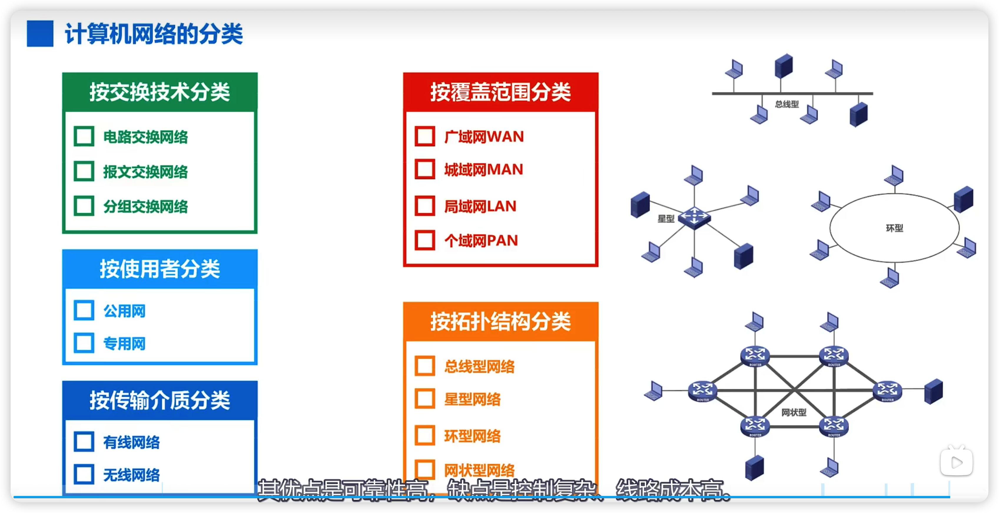

计算机网络

https://www.cnnic.net.cn. 中国互联网络信息中心

**网络由若干节点（node）和连接这些节点的链路（Link）组成**

多个网络还可以通过路由器互联起来，这样就构成了一个覆盖范围更大的网络，既互联网（或互联网）。因此，互联网是**网络的网络**

因特网是世界上最大的互联网络（用户数以亿计，互联的网路以百万计） 此后英特网常常用一朵云来表示

internet与Internet的区别

Internet(互联网或互连网)是一个通用名称，它泛指由多个计算机网络互连而成的网络，在这些网络之间的通信协议可以是任意的。

Internet(因特网)则是一个专用名词，它指当前全球最大的，开放的，有众多网络相互连接而成的特定计算网络，它采用TCP/IP协议作为通信的规则，其前身是美国的ARPANRT

2.因特网发展的三个阶段

从单个网络ARPANET -> 逐步建成三级结构的因特网 -> 逐步形成了多层次ISP结构的因特网

从单个网络ARPANET：

1969，第一个分组交互网ARPANET;

70年代中期，研究多种网络之间的互联

1983年，TCP/IP协议成为ARPAENT的标准协议（因特网诞生时间）

逐步建成三级结构的因特网：

1985年，NSF围绕六个大型计算机中心建设NSFNET（主干网，地区网和校园网）；

1990年，ARPANET任务完成，正式关闭；

1991年，美国政府将因特网主干网交给私人经营，并开始对接入因特网的单位收费

逐步形成了多层次ISP结构的因特网：

1993年，NSFNET逐渐被若干商用因特网主干网替代；政府机构不再负责因特网运营，让各种因特网服务提供ISP来运营

1994年，万维网www技术促进因特网迅速发展；

1995年，NSFNET停止运作，因特网彻底商业化

基于ISP的三层结构的因特网

因特网的标准化工作

- 因特网的标准化工作对因特网的发展起到了非常重要的作用
- 因特网在制定其制定标准上的一个很大的特带你就是面向公众
  - 因特网所有的RFC技术文档都可以从因特网免费下载；
  - 任何人都可以随时用电子邮件发表对某个文档的意见与建议

- 因特网协会ISOC是一个国际性组织，他负责对因特网进行全面管理，以及在世界范围内促进其发展和使用
- 制定因特网的正式标准要经过以下四个阶段：
  - （1） 因特网草案（在这个阶段还不是RFC文档）
  - （2）建议标准（从这个阶段开始就成为RFC文档）
  - （3）草案标准
  - （4）因特网标准

# 因特网的组成

- 边缘部分
  - 由所有连接在因特网上的主机组成，这部分是用户直接使用的，用来进行通信（传送数据，音频）和资源共享

- 核心部分
  - 由大量网络和连接这些网络的路由器组成，这部分是边缘部分提供服务的（提供连通性和交换）

# 三种交换方式

## 电路交换

## 分组交换

用户将报文，分为等长的，然后在钱买呢加上首部，首部的作用是可以让分段报文走不同的路由，最终能走到需要的用户手中，首部是目标地址，不同的路由看到后可以将分段报文送到目的地用户那里去，然后到了后，去掉报文，拼装成完整的报文

可以见到走不同的路由，但最终都可以到达目的地

上述的各自任务

- 发送方
  - 构造分组
  - 发送分组

- 路由器
  - 缓存分组
  - 转发分组
- 接收方
  - 接受分组
  - 还原报文

## 电路交换，报文交换，分组交换对比

# 计算机网络的定义和分类

## 计算机网络的定义

计算机网络的精确定义并未统一

计算机网络的最简单的定义是：一些互相连接，自治的计算机的集合。（**互联，自治，集合**）

- 互连 是指计算机可以通过有线或无线的方式进行数据通信
- 自治 是指独立的计算机，它有自己的硬件和软件，可以单独进行使用；

​	该图是否是一个计算机网络

​	

其实不是一个计算机网络，因为图中所示的各终端机只是具有显示和输入设备的终端，而并不是自治的计算机，因此，这只是一个运行分时系统的大型系统

- 集合 是指至少需要二台计算机；

计算机网络较好的定义是：计算机网络主要是一些通用的，可编程的硬件互连而成，而这些硬件并非专门用来实现某一特定目的（例如，传送数据或视屏信号）。这些可编程的硬件能够用来传送多种不同类型的数据，并能支持广泛的日益增长的应用

- 计算机网络所连接的硬件，并不限于一般的计算机，而是包括了智能手机等智能硬件
- 计算机网络并非专门用来传送数据，而是能够支持很多种的应用（包括今后可能出现的各种应用）。

## 计算机网络的分类

# 计算机网络的性能指标

性能指标可以从不同的方面来度量计算机网络的性能

常见的计算机网络的性能指标有以下8个

- 速率
- 带宽
- 吞吐量
- 时延
- 时延带宽积
- 往返时间
- 利用率
- 丢包率

## 速率

比特是计算机中数据量的单位，也是信息论中信息量的单位。一个·比特就是二进制数字中的一个1或0.常用的数据量的单位   8bit = 1Byte

一块硬盘250g，为什么打开就232.8g

这是因为厂家给出的单位GB中的G，为10的9次方；而操作系统中数据量单位GB中的G为2的30次

速率是指连接在计算机网络上的主机在数字信道上传送比特的速率，也称为比特率或数据率

常用数据率单位

Bit/s(b/s,bps)

Kb/s = 10三次方 b/s.    (bps)

## 带宽

信号所包含的各种不同频率成分所占据的频率范围

单位：Hz(kHz,MHz,GHz)

带宽在计算机网络中的意义

- 用来表示网络的通信线路所能传达数据的能力，因此网络带宽表示在单位时间内从网络的某一点到另一点所能通过的最高数据率；
- 单位： b/s(kb/s,Mb/s,Gb/s,Tb/s)

其实带宽的这两种表叔之间有密切的联系。一条通信线路的频带宽度越宽，其所传输数据的最高数据率也越高

## 吞吐量

- 吞吐量表示在单位时间内通过某个网络（或信道，接口）的数据量。

- 吞吐量被经常用于对现实网络中的网络的一种测量，以便知道实际上到底有多少数据量能够通过网络。
- 吞吐量受网络的带宽或额定速率的限定

## 时延

网络时延由三部分构成发送时延，传播时延，处理时延,一般处理时延不考虑。

那么是发送时延占主导还是传播时延占主导？

所以还是要具体情况具体分析。本课程总结

# 计算机性能指标2

## 时延带宽积

该性能指标是时延与宽带的乘积。**该时延是指传播时延**

时延带宽积 = 传播时延 * 带宽

我们可以把传输链路看成是一个管道 ， 其长度为传播时延，横截面积为带宽，则时延带宽积就是该管道的体积。可以想象成管道中充满了比特。

若发送端连续发送数据，则在所发送的第一个比特即将到达终点时，发送端就已经发送了时延带宽积个比特；

链路的时延带宽积又被称为以比特为单位的链路长度。

## 往返时间

在许多情况下，因特网的信息不仅仅单方向传输，而是双向交互

我们有时很需要知道双向交互一次所需的时间

因此，往返时间RTT也是一个重要的性能指标

RTT是指从源主机发送分组开始，直到源主机收到来自目的主机的确认分组为止，所需要的时间。

答案是卫星链路耗时大，一般情况下，卫星链路的距离远，所带来的传播时延比较大。例如地球同步卫星距离地球36000公里，那么可以计算出通过同步卫星转发分组所带来的传播时延，大约为240毫秒

## 利用率

利用率分为两种 信道利用率和网络利用率

信道利用率用来表示某信道有百分之几的时间是被利用的（有数据通过）

网络利用率：全网络的信道利用率的加权平均。

根据排队论，当某信道的利用率增大时，该信道引起的时延也会迅速增加；

因此，信道利用率并非越高越好；如果令D0表示网络空闲的时延，D表示网络当前的时延，那么在适当的假定条件下，可以用下面的简单公式来表示D，D0和利用率U之间的关系；

## 丢包率

丢包率即分组丢失率，是指在一定的时间范围内，传输过程中丢失的分组数量与总分组数量的比率

丢包率具体可分为接口丢包率，节点丢包率，链路丢包率，路径丢包率，网络丢包率等。

丢包率时网络运维人员非常关心的一个网络性能指标，但对于普通用户来说往往并不关心这个指标，因为他们通常意识不到网络丢包。

分组丢失主要有两种情况：

- 分组在传输过程中出现误码，被结点丢弃；
- 分组到达一台队列已满的分组交换机时被丢弃；在通信量较大时可能造成网络拥塞

因此丢包率反映量网络拥塞情况：

- 无拥塞时路径丢包率为0
- 轻度拥塞时路径丢包率为1%～4%
- 严重拥塞时路径丢包率为%～15%

# 计算机网络体系结构(一)

1.常见的计算机网络体系结构

2.计算机网络体系结构分层的必要性

3.计算机网络体系结构分层思想举例

4.计算机网络体系结构中的专用术语

1.常见的体系结构

TCP/IP在网络层使用的协议是IP协议，IP协议的中文意思是网际协议，因此 TCP/IP体系结构的网络层常被称为网际层。大多数用户每天都有接入因特网的需求，这就要求用户的主机必须使用tcp/ip协议。即使用户的网络不需要接入因特网，也可以使用tcp/ip协议。在用户主机的操作系统中，通常都带有符合TCP/IP体系结构标准的TCP/IP协议族。，而用于网络互联的路由器中，也带有符合TCP/IP体系结构标准的TCP/IP协议族，只不过路由器一般只包含网络接口层和网际层。TCP/IP体系结构的网络接口层并没有什么具体的内容，这样做的目的是可以互联全世界各种不同的网络接口，例如有线的以太网接口，无线局域网的wifi接口。而不限定仅使用一种或几种的网络接口。因此本质上TCP/IP体系结构只有上面的三层。 IP协议是TCP/IP体系结构网际层的核心协议。

IP协议可以将不同的网络接口进行互联，并向其上的TCP协议和UDP协议提供网络互联服务。而TCP协议在享受IP协议提供的网络互联服务的基础上，可向应用层的相应协议提供可靠传输的服务。

UDP协议在享受IP协议提供的网络互联服务的基础上，可向应用层的相应协议提供不可考传输的服务。

IP协议作为TCP/IP体系结构中的核心协议，一方面负责互联不同的网络接口，也就是 IP over everything.另一方面，为各种网络应用提供服务，也就是Everything over IP.

在嵌入式系统开发领域，TCP/IP协议族常称为TCP/IP协议栈，这是因为TCP/IP协议体系的分层结构，与数据中的栈，在图形画法上是类似的。

由于TCP/IP体系结构为了将不同的网络接口进行互连，因此他的网络接口并没有规定什么具体内容，然而对于我们学习计算机体系结构就会缺少一部分内容，因此在学习计算机网络原理时往往采取折中的办法，也就是综合OSI和TCP/IP的优点，采用一种五层协议的原理体系结构

